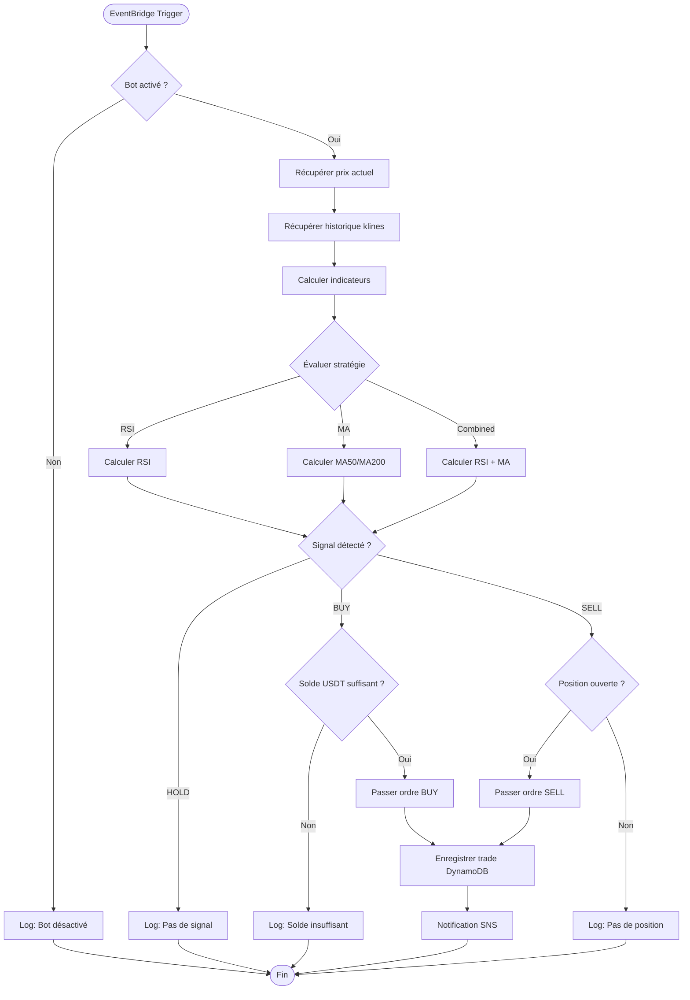

# Exécution Automatique du Bot

## Vue d'ensemble

Le bot de trading s'exécute automatiquement toutes les 5 minutes via AWS EventBridge. Il analyse les conditions du marché, calcule les indicateurs techniques et passe des ordres selon la stratégie configurée.

## Objectifs

- Analyser le marché de manière périodique et autonome
- Détecter les signaux d'achat et de vente
- Exécuter les ordres automatiquement sur Binance
- Enregistrer toutes les actions pour traçabilité
- Notifier l'utilisateur des trades exécutés

## Déclenchement

| Paramètre | Valeur |
|-----------|--------|
| Fréquence | Toutes les 5 minutes |
| Mécanisme | AWS EventBridge (cron) |
| Cible | AWS Lambda (Bref) |
| Commande | `php artisan bot:run` |
| Timeout | 30 secondes |

### Expression Cron EventBridge

```
rate(5 minutes)
```

ou en cron classique :

```
cron(*/5 * * * ? *)
```

## Prérequis d'Exécution

### Conditions Préalables

| Condition | Vérification | Action si échec |
|-----------|--------------|-----------------|
| Bot activé | `bot_config.enabled = true` | Skip exécution |
| Clés API valides | Test connexion Binance | Log erreur + alerte |
| Solde suffisant | Vérification solde > montant trade | Skip trade + log |
| Marché ouvert | Binance disponible | Retry ou skip |

## Flux d'Exécution



## Étapes Détaillées

### 1. Vérification de l'État du Bot

```
Entrée: Configuration bot
Sortie: Boolean (continuer/arrêter)

1. Lire bot_config.enabled depuis DynamoDB
2. Si disabled → log "Bot désactivé" → exit
3. Vérifier dernière exécution (éviter doublons)
4. Si exécution récente (< 4 min) → exit avec warning
```

### 2. Récupération des Données de Marché

| Donnée | Endpoint Binance | Paramètres |
|--------|------------------|------------|
| Prix actuel | `GET /api/v3/ticker/price` | symbol=BTCUSDT |
| Ticker 24h | `GET /api/v3/ticker/24hr` | symbol=BTCUSDT |
| Klines | `GET /api/v3/klines` | symbol, interval=5m, limit=200 |

**Données Klines récupérées :**
- Open time
- Open price
- High price
- Low price
- Close price
- Volume
- Close time

### 3. Calcul des Indicateurs

#### RSI (Relative Strength Index)

```
Période: 14
Seuil survente: < 30
Seuil surachat: > 70

Algorithme:
1. Calculer les variations de prix (close - previous close)
2. Séparer gains et pertes
3. Calculer moyenne mobile des gains (14 périodes)
4. Calculer moyenne mobile des pertes (14 périodes)
5. RS = Average Gain / Average Loss
6. RSI = 100 - (100 / (1 + RS))
```

#### Moyennes Mobiles

```
MA50: Moyenne des 50 derniers close prices
MA200: Moyenne des 200 derniers close prices

Signal Golden Cross: MA50 > MA200 (et MA50 était < MA200)
Signal Death Cross: MA50 < MA200 (et MA50 était > MA200)
```

### 4. Détection des Signaux

| Stratégie | Signal BUY | Signal SELL |
|-----------|------------|-------------|
| RSI | RSI < 30 | RSI > 70 |
| MA | Golden Cross (MA50 croise MA200 vers le haut) | Death Cross (MA50 croise MA200 vers le bas) |
| Combined | RSI < 30 ET MA50 > MA200 | RSI > 70 ET MA50 < MA200 |

### 5. Passage d'Ordre

#### Ordre Market BUY

| Paramètre | Valeur |
|-----------|--------|
| Endpoint | `POST /api/v3/order` |
| symbol | BTCUSDT |
| side | BUY |
| type | MARKET |
| quoteOrderQty | Montant en USDT (ex: 100) |

#### Ordre Market SELL

| Paramètre | Valeur |
|-----------|--------|
| Endpoint | `POST /api/v3/order` |
| symbol | BTCUSDT |
| side | SELL |
| type | MARKET |
| quantity | Quantité de crypto à vendre |

### 6. Enregistrement du Trade

| Attribut | Type | Exemple |
|----------|------|---------|
| pk | String | `TRADE#uuid` |
| sk | String | `METADATA` |
| symbol | String | `BTCUSDT` |
| side | String | `BUY` ou `SELL` |
| type | String | `MARKET` |
| quantity | Number | `0.001` |
| price | Number | `42500.00` |
| quote_quantity | Number | `42.50` |
| order_id | String | ID Binance |
| status | String | `filled` |
| strategy | String | `rsi` |
| indicators | Map | `{rsi: 28.5, ma50: 41200}` |
| created_at | String | ISO 8601 |

### 7. Notification

Publication SNS avec :
- Type de trade (BUY/SELL)
- Symbole et quantité
- Prix d'exécution
- Stratégie utilisée
- Indicateurs au moment du trade

## Gestion des Erreurs

### Erreurs API Binance

| Code | Description | Action |
|------|-------------|--------|
| -1000 | Unknown error | Retry (max 3) |
| -1003 | Too many requests | Backoff + retry |
| -1015 | Too many orders | Skip ce cycle |
| -2010 | Insufficient balance | Log + skip |
| -2011 | Cancel rejected | Log erreur |
| Network error | Timeout/Connection | Retry avec backoff |

### Stratégie de Retry

```
Tentative 1: immédiat
Tentative 2: +1 seconde
Tentative 3: +2 secondes
Échec: Log erreur + Notification SNS (topic erreurs)
```

### Erreurs Critiques (pas de retry)

- Clés API invalides (401)
- Permissions insuffisantes (403)
- Symbole invalide
- Paramètres d'ordre invalides

## Logging

### Niveaux de Log

| Niveau | Usage |
|--------|-------|
| INFO | Début/fin exécution, signaux détectés |
| WARNING | Solde insuffisant, pas de position |
| ERROR | Erreurs API, exceptions |
| DEBUG | Valeurs indicateurs, détails calculs |

### Format de Log

```json
{
  "timestamp": "2024-12-06T10:05:00Z",
  "level": "INFO",
  "message": "Signal BUY détecté",
  "context": {
    "symbol": "BTCUSDT",
    "strategy": "rsi",
    "rsi": 28.5,
    "price": 42500,
    "action": "BUY"
  }
}
```

## Configuration

### Variables d'Environnement

| Variable | Description | Défaut |
|----------|-------------|--------|
| `BOT_ENABLED` | Activer le bot | `false` |
| `BOT_STRATEGY` | Stratégie active | `rsi` |
| `BOT_SYMBOL` | Paire de trading | `BTCUSDT` |
| `BOT_AMOUNT` | Montant par trade (USDT) | `100` |
| `BOT_RSI_PERIOD` | Période RSI | `14` |
| `BOT_RSI_OVERSOLD` | Seuil survente | `30` |
| `BOT_RSI_OVERBOUGHT` | Seuil surachat | `70` |
| `BOT_MA_SHORT` | Période MA courte | `50` |
| `BOT_MA_LONG` | Période MA longue | `200` |

### Configuration DynamoDB

Table `bot_config` :

| Clé | Valeur |
|-----|--------|
| pk | `CONFIG#bot` |
| sk | `SETTINGS` |
| enabled | true/false |
| strategy | rsi/ma/combined |
| symbol | BTCUSDT |
| amount | 100 |
| last_execution | ISO 8601 |
| last_signal | BUY/SELL/HOLD |

## Commande Artisan

### Usage

```bash
# Exécution normale
php artisan bot:run

# Mode dry-run (pas de trade réel)
php artisan bot:run --dry-run

# Forcer même si bot désactivé
php artisan bot:run --force

# Verbose (debug)
php artisan bot:run -v

# Symbole spécifique
php artisan bot:run --symbol=ETHUSDT
```

### Options

| Option | Description |
|--------|-------------|
| `--dry-run` | Analyse sans passer d'ordre |
| `--force` | Ignorer le flag enabled |
| `--symbol=` | Override le symbole configuré |
| `--amount=` | Override le montant configuré |
| `-v` | Mode verbose (debug logs) |

## Métriques et Monitoring

### CloudWatch Metrics

| Métrique | Description |
|----------|-------------|
| `bot.executions` | Nombre d'exécutions |
| `bot.signals.buy` | Signaux d'achat détectés |
| `bot.signals.sell` | Signaux de vente détectés |
| `bot.signals.hold` | Pas de signal |
| `bot.trades.success` | Trades réussis |
| `bot.trades.failed` | Trades échoués |
| `bot.errors` | Erreurs totales |

### Alertes CloudWatch

| Alerte | Condition |
|--------|-----------|
| Bot inactif | 0 exécutions en 30 min |
| Taux d'erreur élevé | > 5 erreurs en 1h |
| Trade échoué | Tout échec de trade |

## Tests

### Tests Unitaires

| Test | Description |
|------|-------------|
| RSI calculation | Vérifier calcul RSI sur données connues |
| MA calculation | Vérifier calcul MA50/MA200 |
| Signal detection RSI | Tester seuils 30/70 |
| Signal detection MA | Tester golden/death cross |

### Tests d'Intégration

| Test | Description |
|------|-------------|
| Full execution (dry-run) | Cycle complet sans trade |
| Binance API mock | Simulation réponses API |
| DynamoDB local | Test avec DynamoDB local |

### Testnet

Toujours tester sur Binance Testnet avant production :
- URL : https://testnet.binance.vision/
- Fonds virtuels illimités
- Mêmes endpoints que production

## Sécurité

### Clés API

- Stockées dans SSM Parameter Store (SecureString)
- Jamais en clair dans le code ou logs
- Permissions minimales (lecture + trading spot uniquement)
- Pas de permission de retrait

### Limites de Sécurité

| Limite | Valeur | But |
|--------|--------|-----|
| Max trade/jour | 50 | Éviter emballement |
| Max montant/trade | 1000 USDT | Limiter pertes |
| Cooldown entre trades | 5 min | Éviter sur-trading |
| Max drawdown | 10% | Stop-loss global |

## Évolutions Futures

### Court Terme
- Stop-loss automatique par trade
- Take-profit configurable
- Trailing stop

### Moyen Terme
- Multi-paires simultanées
- Gestion de position (position sizing)
- Backtesting intégré

### Long Terme
- Machine Learning pour signaux
- Optimisation automatique des paramètres
- Arbitrage entre exchanges
