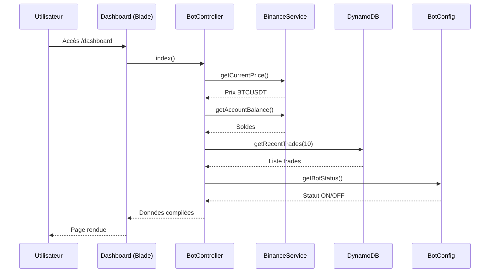
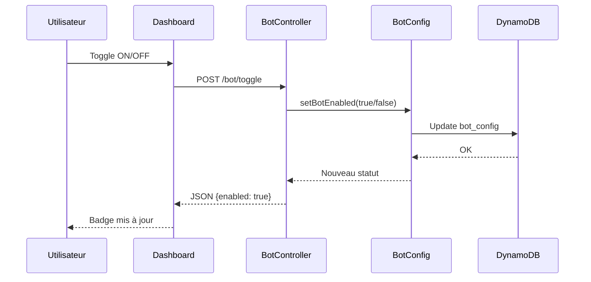
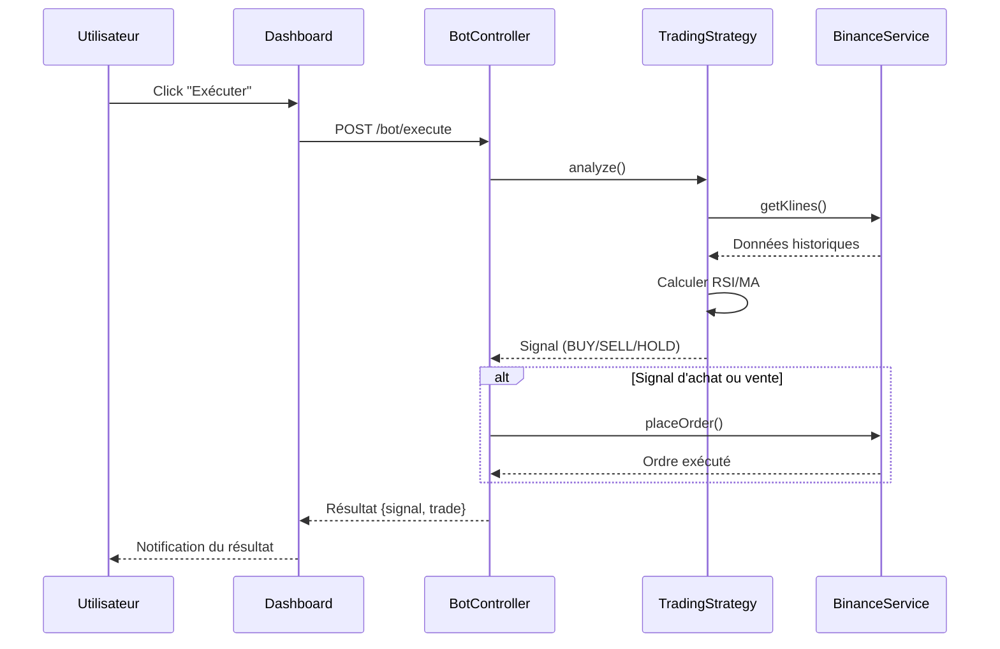

# Dashboard Web

## Vue d'ensemble

Le dashboard est l'interface web principale permettant de visualiser l'état du bot, surveiller les prix en temps réel et contrôler manuellement le trading.

## Objectifs

- Fournir une vue synthétique de l'état du portefeuille
- Afficher les prix des cryptomonnaies en temps réel
- Permettre le contrôle manuel du bot (ON/OFF)
- Visualiser l'historique des trades récents
- Exécuter manuellement une stratégie de trading

## Accès

| Paramètre | Valeur |
|-----------|--------|
| URL | `/dashboard` ou `/` |
| Authentification | Requise (à implémenter) |
| Technologies | Blade + Tailwind CSS |
| Rafraîchissement | Manuel ou auto (polling) |

## Composants de l'Interface

### 1. En-tête

| Élément | Description |
|---------|-------------|
| Logo/Titre | "Trading Bot" |
| Statut du bot | Badge ON (vert) / OFF (rouge) |
| Dernière mise à jour | Horodatage du dernier refresh |
| Bouton refresh | Actualisation manuelle |

### 2. Section Prix en Temps Réel

Affichage du prix actuel de la paire principale :

| Information | Exemple |
|-------------|---------|
| Symbole | BTCUSDT |
| Prix actuel | 42,500.00 USDT |
| Variation 24h | +2.5% |
| Plus haut 24h | 43,200.00 USDT |
| Plus bas 24h | 41,800.00 USDT |
| Volume 24h | 1,234.56 BTC |

**Indicateur visuel :**
- Prix en hausse : texte vert avec flèche vers le haut
- Prix en baisse : texte rouge avec flèche vers le bas

### 3. Section Solde du Compte

Affichage des soldes par devise :

| Colonne | Description |
|---------|-------------|
| Devise | BTC, ETH, USDT, etc. |
| Disponible | Solde libre |
| En ordre | Solde bloqué dans des ordres |
| Total | Disponible + En ordre |
| Valeur USDT | Conversion au prix actuel |

**Résumé :**
- Valeur totale du portefeuille en USDT
- Variation depuis le début (si disponible)

### 4. Section Contrôle du Bot

| Élément | Description |
|---------|-------------|
| Toggle ON/OFF | Switch pour activer/désactiver le bot |
| Stratégie active | Dropdown : RSI, MA, Combinée |
| Paire de trading | Input : BTCUSDT (défaut) |
| Montant par trade | Input : 100 USDT (défaut) |
| Bouton "Exécuter maintenant" | Lance la stratégie manuellement |

**États du bot :**

| État | Description | Couleur |
|------|-------------|---------|
| Actif | Bot en fonctionnement | Vert |
| Inactif | Bot désactivé | Gris |
| En exécution | Stratégie en cours | Bleu (pulsing) |
| Erreur | Dernière exécution échouée | Rouge |

### 5. Section Historique des Trades

Liste des 10 derniers trades :

| Colonne | Description |
|---------|-------------|
| Date/Heure | Format : DD/MM HH:mm |
| Type | BUY (vert) / SELL (rouge) |
| Symbole | BTCUSDT |
| Quantité | 0.001 BTC |
| Prix | 42,500 USDT |
| Total | 42.50 USDT |
| Statut | filled, pending, cancelled, error |
| P&L | +/- en USDT (si vente) |

**Filtres :**
- Par type (BUY/SELL/Tous)
- Par statut
- Par période (Aujourd'hui, 7 jours, 30 jours)

### 6. Section Performance

| Métrique | Description |
|----------|-------------|
| P&L Total | Gains/pertes cumulés |
| P&L Aujourd'hui | Gains/pertes du jour |
| Nombre de trades | Total depuis le début |
| Taux de réussite | % de trades gagnants |
| Meilleur trade | Plus gros gain |
| Pire trade | Plus grosse perte |

### 7. Section Indicateurs Techniques (optionnel)

Affichage des indicateurs calculés :

| Indicateur | Valeur | Signal |
|------------|--------|--------|
| RSI (14) | 32.5 | Survente (Achat) |
| MA50 | 41,200 | - |
| MA200 | 40,800 | Golden Cross (Achat) |

## Flux de Données

## Actions Utilisateur

### Activer/Désactiver le Bot

### Exécuter la Stratégie Manuellement

## Routes Web

| Méthode | Route | Action | Description |
|---------|-------|--------|-------------|
| GET | `/` | redirect to /dashboard | Redirection |
| GET | `/dashboard` | DashboardController@index | Page principale |
| POST | `/bot/toggle` | BotController@toggle | Activer/désactiver |
| POST | `/bot/execute` | BotController@execute | Exécution manuelle |
| GET | `/bot/status` | BotController@status | Statut JSON (API) |
| GET | `/trades` | TradeController@index | Liste paginée |
| GET | `/trades/{id}` | TradeController@show | Détail d'un trade |

## Validation des Entrées

### Formulaire de Configuration

| Champ | Type | Règles |
|-------|------|--------|
| strategy | string | required, in:rsi,ma,combined |
| symbol | string | required, regex:/^[A-Z]+$/, max:20 |
| amount | numeric | required, min:10, max:10000 |

## États et Messages

### Messages Flash

| Type | Message | Contexte |
|------|---------|----------|
| success | "Bot activé avec succès" | Toggle ON |
| success | "Bot désactivé" | Toggle OFF |
| success | "Ordre BUY exécuté : 0.001 BTC @ 42,500" | Trade réussi |
| info | "Aucun signal détecté" | Exécution sans trade |
| warning | "Solde insuffisant" | Tentative d'achat |
| error | "Erreur API Binance : Rate limit" | Erreur externe |

### Codes d'Erreur UI

| Code | Description | Action |
|------|-------------|--------|
| E001 | Connexion Binance échouée | Afficher erreur + retry |
| E002 | Solde insuffisant | Désactiver bouton achat |
| E003 | Paire invalide | Highlight champ + message |
| E004 | Session expirée | Redirect login |

## Responsive Design

### Breakpoints Tailwind

| Breakpoint | Largeur | Layout |
|------------|---------|--------|
| sm | 640px | 1 colonne |
| md | 768px | 2 colonnes |
| lg | 1024px | 3 colonnes |
| xl | 1280px | Layout complet |

### Priorité Mobile

1. Prix actuel + Variation
2. Solde total USDT
3. Toggle ON/OFF
4. Derniers 3 trades
5. Autres sections (collapsibles)

## Sécurité

### Authentification (à implémenter)

- Middleware `auth` sur toutes les routes
- Session sécurisée (HTTPS obligatoire)
- CSRF token sur tous les formulaires
- Rate limiting sur les actions sensibles

### Permissions API Binance

Le dashboard utilise uniquement les permissions :
- **Lecture** : Prix, soldes, historique
- **Trading Spot** : Passage d'ordres (si autorisé)

## Configuration

### Variables d'Environnement

| Variable | Description | Défaut |
|----------|-------------|--------|
| `BOT_ENABLED` | État initial du bot | `false` |
| `BOT_STRATEGY` | Stratégie par défaut | `rsi` |
| `BOT_SYMBOL` | Paire par défaut | `BTCUSDT` |
| `BOT_AMOUNT` | Montant par défaut | `100` |
| `DASHBOARD_REFRESH_INTERVAL` | Intervalle auto-refresh (ms) | `30000` |

## Tests

### Scénarios de Test

| Scénario | Action | Résultat attendu |
|----------|--------|------------------|
| Chargement initial | Accès /dashboard | Toutes les sections affichées |
| Toggle bot ON | Click switch | Badge passe en vert |
| Toggle bot OFF | Click switch | Badge passe en gris |
| Exécution manuelle | Click "Exécuter" | Signal affiché + trade si applicable |
| Erreur API | Binance indisponible | Message d'erreur gracieux |
| Refresh données | Click refresh | Données mises à jour |
| Filtre trades | Sélection "BUY only" | Liste filtrée |

## Évolutions Futures

### Court Terme
- Auto-refresh configurable
- Graphique de prix (Chart.js ou ApexCharts)
- Export CSV des trades

### Moyen Terme
- WebSocket pour prix temps réel
- Notifications push (ServiceWorker)
- Mode sombre

### Long Terme
- PWA (Progressive Web App)
- Multi-paires simultanées
- Comparaison de stratégies
