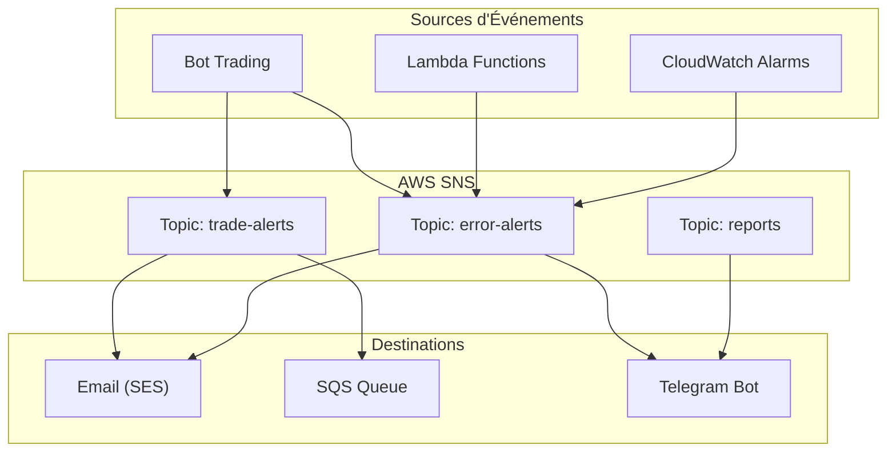

# Notifications et Alertes

## Vue d'ensemble

Le système de notifications informe l'utilisateur des événements importants du bot de trading : trades exécutés, erreurs critiques, alertes de marché. Les notifications transitent via AWS SNS et peuvent être délivrées par email, SMS ou Telegram.

## Objectifs

- Alerter en temps réel lors de l'exécution de trades
- Notifier les erreurs critiques nécessitant une intervention
- Fournir des alertes de marché configurables
- Permettre plusieurs canaux de notification
- Éviter le spam tout en garantissant la réception des alertes importantes

## Types de Notifications

### 1. Notifications de Trade

Envoyées lors de chaque trade exécuté par le bot.

| Champ | Description |
|-------|-------------|
| Type | TRADE_EXECUTED |
| Priorité | Normale |
| Canaux | SNS (email), Telegram |
| Fréquence | À chaque trade |

**Contenu :**
- Type d'ordre (BUY/SELL)
- Symbole et quantité
- Prix d'exécution
- P&L (si vente)
- Stratégie utilisée

**Exemple Telegram :**
```
🟢 Trade Exécuté

BUY 0.001 BTC @ 42,500 USDT
Total: 42.50 USDT
Stratégie: RSI (28.5)

06/12/2024 10:30:15 UTC
```

### 2. Alertes d'Erreur

Envoyées lors d'erreurs critiques du système.

| Champ | Description |
|-------|-------------|
| Type | ERROR_ALERT |
| Priorité | Haute |
| Canaux | SNS (email), Telegram |
| Fréquence | Immédiate |

**Déclencheurs :**
- Échec de connexion API Binance
- Clé API invalide
- Erreur d'exécution d'ordre
- Échec de la fonction Lambda

**Exemple :**
```
🔴 Erreur Critique

Type: API_CONNECTION_FAILED
Message: Unable to connect to Binance API
Code: -1001

Action requise: Vérifier les clés API

06/12/2024 10:35:00 UTC
```

### 3. Alertes de Solde

Envoyées quand le solde passe sous un seuil configuré.

| Champ | Description |
|-------|-------------|
| Type | BALANCE_ALERT |
| Priorité | Moyenne |
| Canaux | SNS (email), Telegram |
| Fréquence | Max 1x/jour par seuil |

**Seuils configurables :**
- Solde USDT < X
- Solde crypto < Y
- Drawdown > Z%

### 4. Alertes de Prix

Alertes personnalisées sur les mouvements de prix.

| Champ | Description |
|-------|-------------|
| Type | PRICE_ALERT |
| Priorité | Normale |
| Canaux | Telegram |
| Fréquence | À la condition |

**Types d'alertes :**
- Prix au-dessus de X
- Prix en-dessous de Y
- Variation > Z% en 1h/24h

### 5. Résumé Quotidien

Rapport journalier des activités (voir specs/reporting.md).

| Champ | Description |
|-------|-------------|
| Type | DAILY_REPORT |
| Priorité | Normale |
| Canaux | Telegram |
| Fréquence | 1x/jour (08h00 UTC) |

## Architecture



## Configuration SNS

### Topics

| Topic | Nom | Description |
|-------|-----|-------------|
| Trades | `trading-bot-{env}-sns-trade-alerts` | Notifications de trades |
| Erreurs | `trading-bot-{env}-sns-error-alerts` | Alertes d'erreurs |
| Reports | `trading-bot-{env}-sns-reports` | Rapports quotidiens |

### Structure du Message SNS

```json
{
  "Type": "Notification",
  "MessageId": "uuid",
  "TopicArn": "arn:aws:sns:eu-west-3:xxx:trading-bot-prod-sns-trade-alerts",
  "Subject": "Trade Executed: BUY BTCUSDT",
  "Message": "{\"type\":\"TRADE_EXECUTED\",\"data\":{...}}",
  "Timestamp": "2024-12-06T10:30:15.000Z",
  "MessageAttributes": {
    "event_type": {
      "Type": "String",
      "Value": "TRADE_EXECUTED"
    },
    "priority": {
      "Type": "String",
      "Value": "normal"
    }
  }
}
```

### Payload Message

```json
{
  "type": "TRADE_EXECUTED",
  "priority": "normal",
  "timestamp": "2024-12-06T10:30:15Z",
  "data": {
    "trade_id": "uuid",
    "symbol": "BTCUSDT",
    "side": "BUY",
    "quantity": 0.001,
    "price": 42500,
    "quote_quantity": 42.50,
    "strategy": "rsi",
    "indicators": {
      "rsi": 28.5
    }
  }
}
```

## Subscriptions SNS

### Email (via SES)

| Paramètre | Valeur |
|-----------|--------|
| Protocol | email |
| Endpoint | user@example.com |
| Filter Policy | Optionnel |

### Telegram (via Lambda)

| Paramètre | Valeur |
|-----------|--------|
| Protocol | lambda |
| Endpoint | ARN de la Lambda notification |
| Filter Policy | Par type d'événement |

### SQS (pour traitement asynchrone)

| Paramètre | Valeur |
|-----------|--------|
| Protocol | sqs |
| Endpoint | ARN de la queue |
| Usage | Archivage, traitement batch |

## Filter Policies

Permettent de router les messages vers les bonnes destinations.

### Filtrer par Type

```json
{
  "event_type": ["TRADE_EXECUTED", "ERROR_ALERT"]
}
```

### Filtrer par Priorité

```json
{
  "priority": ["high", "critical"]
}
```

### Filtrer par Symbole

```json
{
  "symbol": ["BTCUSDT", "ETHUSDT"]
}
```

## Service Laravel

### Interface NotificationService

```php
interface NotificationServiceInterface
{
    // Notifications de trade
    public function notifyTradeExecuted(Trade $trade): void;

    // Alertes d'erreur
    public function notifyError(string $type, string $message, array $context = []): void;
    public function notifyCriticalError(Throwable $exception): void;

    // Alertes de solde
    public function notifyLowBalance(string $asset, float $balance, float $threshold): void;

    // Alertes de prix
    public function notifyPriceAlert(string $symbol, float $price, string $condition): void;

    // Rapports
    public function sendDailyReport(DailyReport $report): void;
}
```

### Implémentation Multi-Canal

```php
class NotificationService implements NotificationServiceInterface
{
    public function __construct(
        private readonly SnsClient $sns,
        private readonly TelegramService $telegram,
        private readonly array $config
    ) {}

    public function notifyTradeExecuted(Trade $trade): void
    {
        // Publier sur SNS (distribue vers email, SQS)
        $this->publishToSns('trade-alerts', [
            'type' => 'TRADE_EXECUTED',
            'data' => $trade->toArray(),
        ]);

        // Envoi direct Telegram (temps réel)
        if ($this->config['telegram_enabled']) {
            $this->telegram->sendTradeNotification($trade);
        }
    }
}
```

## Telegram

### Format des Messages

#### Trade Exécuté

```
🟢 *Trade Exécuté*

*BUY* 0\.001 BTC @ 42,500 USDT
Total: 42\.50 USDT

📊 Stratégie: RSI \(28\.5\)
⏰ 06/12/2024 10:30:15 UTC
```

#### Erreur Critique

```
🔴 *Erreur Critique*

*Type:* API\_CONNECTION\_FAILED
*Message:* Unable to connect to Binance API

⚠️ Action requise

⏰ 06/12/2024 10:35:00 UTC
```

#### Alerte de Solde

```
⚠️ *Alerte Solde Bas*

Votre solde USDT est passé sous le seuil\.

💰 Solde actuel: 50 USDT
📉 Seuil configuré: 100 USDT

⏰ 06/12/2024 10:40:00 UTC
```

### Inline Keyboards (Évolution future)

Boutons interactifs pour actions rapides :

```
[Voir Dashboard] [Désactiver Bot] [Ignorer]
```

## Throttling et Rate Limiting

### Règles Anti-Spam

| Type de Notification | Limite |
|----------------------|--------|
| Trade exécuté | Illimité (1 par trade) |
| Erreur critique | Max 10/heure |
| Alerte de solde | Max 1/jour par seuil |
| Alerte de prix | Max 1/heure par condition |

### Implémentation

```php
class NotificationThrottler
{
    public function shouldSend(string $type, string $key): bool
    {
        $cacheKey = "notification_throttle:{$type}:{$key}";
        $ttl = $this->getTtlForType($type);

        if (Cache::has($cacheKey)) {
            return false;
        }

        Cache::put($cacheKey, true, $ttl);
        return true;
    }
}
```

## Configuration

### Variables d'Environnement

| Variable | Description | Défaut |
|----------|-------------|--------|
| `NOTIFICATIONS_ENABLED` | Activer les notifications | `true` |
| `SNS_TOPIC_TRADES` | ARN topic trades | - |
| `SNS_TOPIC_ERRORS` | ARN topic erreurs | - |
| `TELEGRAM_BOT_TOKEN` | Token bot Telegram | - |
| `TELEGRAM_CHAT_ID` | Chat ID destinataire | - |
| `TELEGRAM_ENABLED` | Activer Telegram | `true` |
| `NOTIFICATION_EMAIL` | Email destinataire | - |
| `BALANCE_THRESHOLD_USDT` | Seuil alerte USDT | `100` |

### Configuration DynamoDB

Table `notification_config` :

| Clé | Type | Description |
|-----|------|-------------|
| pk | String | `NOTIFICATION#settings` |
| sk | String | `GLOBAL` |
| trade_alerts | Boolean | Alertes de trade |
| error_alerts | Boolean | Alertes d'erreur |
| balance_alerts | Boolean | Alertes de solde |
| balance_threshold | Number | Seuil en USDT |
| price_alerts | List | Liste des alertes prix |
| quiet_hours | Map | Heures silencieuses |

## Gestion des Erreurs

### Échec d'Envoi SNS

```
1. Logger l'erreur
2. Retry (max 3 avec backoff)
3. Si échec persistant → Dead Letter Queue
4. Alerte monitoring
```

### Échec Telegram

```
1. Logger l'erreur
2. Retry (max 3)
3. Si échec → Fallback vers SNS/Email
4. Stocker pour renvoi ultérieur
```

## Dead Letter Queue (DLQ)

Messages non délivrés stockés pour analyse :

| Queue | Nom |
|-------|-----|
| DLQ | `trading-bot-{env}-sqs-notifications-dlq` |
| Rétention | 14 jours |
| Alerte | Si > 0 messages |

## Monitoring

### Métriques CloudWatch

| Métrique | Description |
|----------|-------------|
| notifications.sent | Notifications envoyées |
| notifications.failed | Échecs d'envoi |
| notifications.throttled | Notifications throttlées |
| sns.publish.success | Publications SNS réussies |
| telegram.send.success | Messages Telegram réussis |

### Alertes

| Alerte | Condition |
|--------|-----------|
| Taux d'échec élevé | > 10% échecs en 1h |
| DLQ non vide | Messages en DLQ |
| Telegram down | 5 échecs consécutifs |

## Tests

### Tests Unitaires

| Test | Description |
|------|-------------|
| Message formatting | Vérifier format Telegram |
| Throttling | Vérifier limites respectées |
| Filter policies | Vérifier routage correct |

### Tests d'Intégration

| Test | Description |
|------|-------------|
| SNS publish | Publication réelle sur topic test |
| Telegram send | Envoi vers chat de test |
| End-to-end | Trade → Notification reçue |

## Sécurité

### Tokens et Credentials

- Token Telegram dans SSM Parameter Store (SecureString)
- ARN SNS dans variables d'environnement
- Pas de credentials en clair

### Données Sensibles

- Ne pas inclure les clés API dans les notifications
- Masquer les montants si configuré
- Chiffrement en transit (TLS)

## Évolutions Futures

### Court Terme
- Inline keyboards Telegram
- Préférences utilisateur (canaux, types)
- Heures silencieuses

### Moyen Terme
- Discord webhook
- Slack integration
- Push notifications (PWA)

### Long Terme
- Notifications intelligentes (ML)
- Agrégation de notifications
- Assistant conversationnel Telegram
