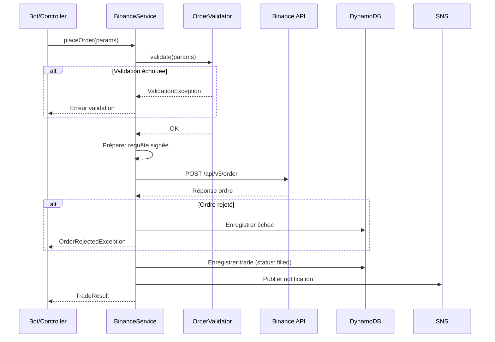
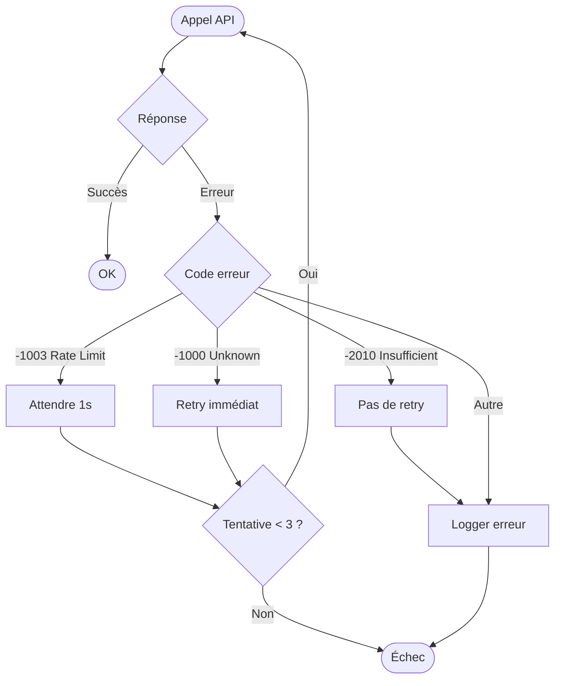

# Gestion des Ordres

## Vue d'ensemble

Le système de gestion des ordres permet de passer, suivre et gérer les ordres d'achat et de vente sur Binance. Il assure la traçabilité complète des transactions et la gestion des erreurs.

## Objectifs

- Passer des ordres d'achat et de vente sur Binance
- Supporter différents types d'ordres (market, limit)
- Enregistrer tous les ordres en base de données
- Gérer les erreurs et les cas limites
- Fournir un suivi en temps réel des ordres

## Types d'Ordres Supportés

### Market Order

Exécution immédiate au meilleur prix disponible.

| Paramètre | Description |
|-----------|-------------|
| Type | MARKET |
| Exécution | Immédiate |
| Prix | Meilleur prix disponible |
| Garantie | Exécution garantie (si liquidité) |
| Usage | Entrée/sortie rapide |

**Avantages :**
- Exécution garantie
- Simplicité

**Inconvénients :**
- Slippage possible (écart prix demandé vs exécuté)
- Pas de contrôle sur le prix

### Limit Order

Exécution à un prix spécifique ou meilleur.

| Paramètre | Description |
|-----------|-------------|
| Type | LIMIT |
| Exécution | Quand le prix est atteint |
| Prix | Prix spécifié par l'utilisateur |
| Garantie | Prix garanti, pas l'exécution |
| Usage | Entrée/sortie à prix défini |

**Avantages :**
- Contrôle du prix
- Pas de slippage

**Inconvénients :**
- Peut ne jamais être exécuté
- Nécessite une gestion (annulation, mise à jour)

### Stop-Loss Order (évolution future)

Ordre déclenché quand le prix atteint un seuil.

| Paramètre | Description |
|-----------|-------------|
| Type | STOP_LOSS ou STOP_LOSS_LIMIT |
| Déclencheur | Prix stop atteint |
| Exécution | Market ou Limit après déclenchement |
| Usage | Protection contre les pertes |

## Structure d'un Ordre

### Paramètres d'Entrée

| Paramètre | Type | Requis | Description |
|-----------|------|--------|-------------|
| symbol | string | Oui | Paire de trading (ex: BTCUSDT) |
| side | string | Oui | BUY ou SELL |
| type | string | Oui | MARKET ou LIMIT |
| quantity | decimal | Conditionnel | Quantité de crypto |
| quoteOrderQty | decimal | Conditionnel | Montant en quote (USDT) |
| price | decimal | Si LIMIT | Prix limite |
| timeInForce | string | Si LIMIT | GTC, IOC, FOK |

### Time In Force (Limit Orders)

| Valeur | Nom | Description |
|--------|-----|-------------|
| GTC | Good Till Cancelled | Actif jusqu'à annulation |
| IOC | Immediate Or Cancel | Exécution immédiate partielle possible |
| FOK | Fill Or Kill | Tout ou rien immédiatement |

### Réponse Binance

```json
{
  "symbol": "BTCUSDT",
  "orderId": 123456789,
  "orderListId": -1,
  "clientOrderId": "abc123",
  "transactTime": 1702468800000,
  "price": "42500.00",
  "origQty": "0.001",
  "executedQty": "0.001",
  "cummulativeQuoteQty": "42.50",
  "status": "FILLED",
  "timeInForce": "GTC",
  "type": "MARKET",
  "side": "BUY",
  "fills": [
    {
      "price": "42500.00",
      "qty": "0.001",
      "commission": "0.00004250",
      "commissionAsset": "BNB"
    }
  ]
}
```

## Statuts d'Ordre

| Statut | Description | Final |
|--------|-------------|-------|
| NEW | Ordre créé, en attente | Non |
| PARTIALLY_FILLED | Exécution partielle | Non |
| FILLED | Entièrement exécuté | Oui |
| CANCELED | Annulé par l'utilisateur | Oui |
| PENDING_CANCEL | Annulation en cours | Non |
| REJECTED | Rejeté par le système | Oui |
| EXPIRED | Expiré (limit non atteint) | Oui |

## Flux de Passage d'Ordre



## Validation des Ordres

### Règles de Validation

| Règle | Vérification |
|-------|--------------|
| Symbole valide | Existe sur Binance |
| Quantité minimale | >= minQty du symbole |
| Quantité maximale | <= maxQty du symbole |
| Step size | Quantité multiple de stepSize |
| Prix minimum | >= minPrice |
| Prix maximum | <= maxPrice |
| Tick size | Prix multiple de tickSize |
| Notional minimum | quantity * price >= minNotional |
| Solde suffisant | BUY: USDT, SELL: crypto |

### Récupération des Règles (Exchange Info)

```
GET /api/v3/exchangeInfo?symbol=BTCUSDT
```

Filtres importants :
- `LOT_SIZE` : minQty, maxQty, stepSize
- `PRICE_FILTER` : minPrice, maxPrice, tickSize
- `MIN_NOTIONAL` : minNotional
- `NOTIONAL` : minNotional, maxNotional

## Stockage DynamoDB

### Structure Trade

| Attribut | Type | Description |
|----------|------|-------------|
| pk | String | `TRADE#{uuid}` |
| sk | String | `METADATA` |
| order_id | Number | ID ordre Binance |
| client_order_id | String | ID client unique |
| symbol | String | Paire (BTCUSDT) |
| side | String | BUY / SELL |
| type | String | MARKET / LIMIT |
| status | String | Statut Binance |
| quantity | Number | Quantité exécutée |
| price | Number | Prix d'exécution |
| quote_quantity | Number | Montant total USDT |
| commission | Number | Frais |
| commission_asset | String | Devise des frais |
| strategy | String | Stratégie utilisée |
| created_at | String | ISO 8601 |
| updated_at | String | ISO 8601 |
| gsi1pk | String | `SYMBOL#BTCUSDT` |
| gsi1sk | String | `{created_at}` |

### Index Secondaires (GSI)

| GSI | PK | SK | Usage |
|-----|----|----|-------|
| symbol-date-index | SYMBOL#{symbol} | {created_at} | Trades par paire |
| status-index | STATUS#{status} | {created_at} | Trades par statut |
| date-index | DATE#{YYYY-MM-DD} | {created_at} | Trades par jour |

## Calcul des Frais

### Structure des Frais Binance

| Type | Taux Standard | Avec BNB |
|------|---------------|----------|
| Maker | 0.10% | 0.075% |
| Taker | 0.10% | 0.075% |

**Note :** Les ordres Market sont toujours Taker.

### Calcul

```
Frais = quantity * price * taux
Exemple: 0.001 BTC * 42500 USDT * 0.001 = 0.0425 USDT
```

### Gestion des Frais en BNB

Si le compte détient du BNB et que l'option est activée :
- Frais prélevés en BNB
- Réduction de 25%

## Gestion des Erreurs

### Codes d'Erreur Binance

| Code | Message | Cause | Action |
|------|---------|-------|--------|
| -1000 | Unknown | Erreur interne | Retry |
| -1003 | Too many requests | Rate limit | Backoff + retry |
| -1013 | Invalid quantity | Quantité invalide | Ajuster quantité |
| -1021 | Timestamp outside window | Décalage horloge | Sync NTP |
| -2010 | Insufficient balance | Solde insuffisant | Skip |
| -2011 | Unknown order | Ordre inexistant | Log |
| -2014 | Bad API key | Clé invalide | Alerte critique |

### Stratégie de Retry



## Annulation d'Ordre

### Annuler un Ordre Spécifique

```
DELETE /api/v3/order
Params: symbol, orderId ou origClientOrderId
```

### Annuler Tous les Ordres Ouverts

```
DELETE /api/v3/openOrders
Params: symbol
```

### Cas d'Usage

- Ordre limit non exécuté après X temps
- Changement de stratégie
- Stop manuel par l'utilisateur

## Consultation des Ordres

### Ordre Spécifique

```
GET /api/v3/order
Params: symbol, orderId
```

### Ordres Ouverts

```
GET /api/v3/openOrders
Params: symbol (optionnel)
```

### Historique des Ordres

```
GET /api/v3/allOrders
Params: symbol, limit (défaut 500, max 1000)
```

## Service Laravel

### Interface BinanceService

```php
interface BinanceServiceInterface
{
    // Passage d'ordres
    public function marketBuy(string $symbol, float $quoteQty): TradeResult;
    public function marketSell(string $symbol, float $quantity): TradeResult;
    public function limitBuy(string $symbol, float $quantity, float $price): TradeResult;
    public function limitSell(string $symbol, float $quantity, float $price): TradeResult;

    // Gestion des ordres
    public function getOrder(string $symbol, int $orderId): Order;
    public function cancelOrder(string $symbol, int $orderId): bool;
    public function getOpenOrders(?string $symbol = null): array;

    // Informations
    public function getExchangeInfo(string $symbol): SymbolInfo;
    public function getAccountBalance(): array;
}
```

### DTO TradeResult

```php
class TradeResult
{
    public string $orderId;
    public string $symbol;
    public string $side;
    public string $type;
    public string $status;
    public float $executedQty;
    public float $price;
    public float $quoteQty;
    public float $commission;
    public string $commissionAsset;
    public Carbon $transactTime;
}
```

## Tests

### Tests Unitaires

| Test | Description |
|------|-------------|
| Validation quantité min | Rejet si < minQty |
| Validation step size | Rejet si pas multiple |
| Validation notional | Rejet si < minNotional |
| Calcul frais | Vérifier calcul correct |

### Tests d'Intégration (Testnet)

| Test | Description |
|------|-------------|
| Market buy | Achat market réussi |
| Market sell | Vente market réussie |
| Limit buy | Ordre limit créé |
| Cancel order | Annulation réussie |
| Insufficient balance | Gestion erreur -2010 |

## Monitoring

### Métriques

| Métrique | Description |
|----------|-------------|
| orders.placed | Ordres passés |
| orders.filled | Ordres exécutés |
| orders.rejected | Ordres rejetés |
| orders.cancelled | Ordres annulés |
| orders.latency | Temps de réponse API |

### Alertes

| Alerte | Condition |
|--------|-----------|
| Taux d'échec élevé | > 10% ordres rejetés |
| Latence élevée | > 5s temps réponse |
| API Key invalide | Erreur -2014 |

## Sécurité

### Signature des Requêtes

Toutes les requêtes d'ordre doivent être signées :

```
1. Construire query string avec tous les paramètres
2. Ajouter timestamp=<milliseconds>
3. Calculer signature HMAC-SHA256 avec API Secret
4. Ajouter signature=<hash> à la requête
```

### Validation Serveur

- Timestamp dans fenêtre de 5000ms
- Signature valide
- Permissions API correctes

## Évolutions Futures

### Court Terme
- Support OCO orders (One Cancels Other)
- Stop-loss automatique
- Take-profit

### Moyen Terme
- Trailing stop
- Orders conditionnels
- Gestion de position avancée

### Long Terme
- Smart order routing
- Ordres algorithmiques (TWAP, VWAP)
- Support futures/margin
