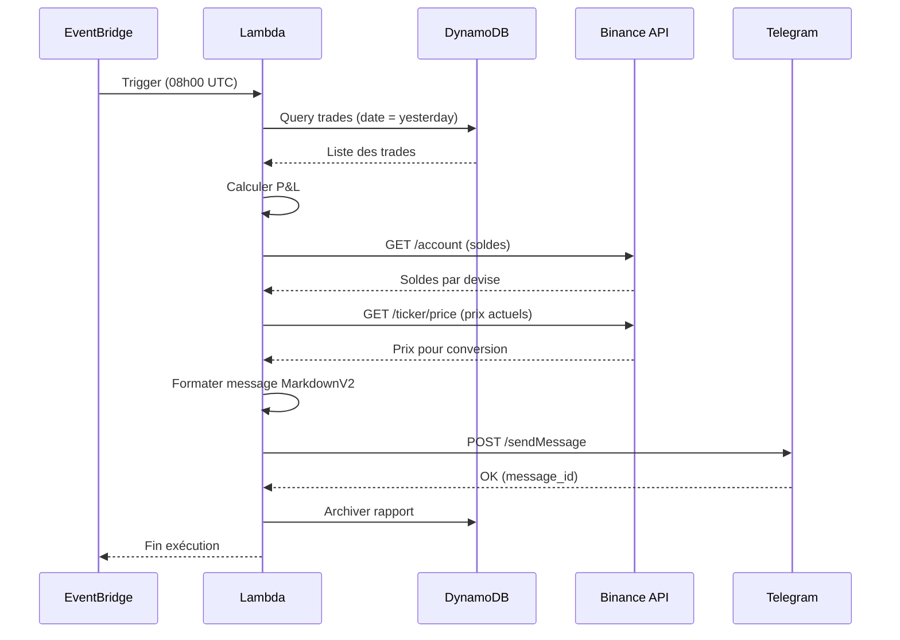

# Reporting Quotidien

## Vue d'ensemble

Le système de reporting envoie automatiquement un rapport journalier via Telegram, récapitulant l'activité du bot de trading et la performance du portefeuille.

## Objectifs

- Informer l'utilisateur de l'activité quotidienne du bot
- Fournir une vue synthétique de la performance (P&L)
- Permettre un suivi régulier sans accès au dashboard
- Archiver l'historique des rapports pour analyse

## Déclenchement

| Paramètre | Valeur |
|-----------|--------|
| Fréquence | Quotidien |
| Heure | 08h00 UTC |
| Mécanisme | AWS EventBridge (cron) |
| Commande | `php artisan report:daily` |

### Expression Cron EventBridge

```
cron(0 8 * * ? *)
```

## Contenu du Rapport

### 1. En-tête

- Date du rapport (format : JJ/MM/AAAA)
- Période couverte : 00h00 - 23h59 UTC (jour précédent)

### 2. Résumé des Trades

Liste des trades exécutés dans la journée :

| Information | Description |
|-------------|-------------|
| Type | BUY ou SELL |
| Symbole | Paire tradée (ex: BTCUSDT) |
| Quantité | Montant de la crypto |
| Prix | Prix d'exécution |
| Horodatage | Heure du trade |
| Statut | filled, cancelled, error |

**Format d'affichage :**
```
• BUY 0.001 BTC @ 42,500 USDT (10:30)
• SELL 0.001 BTC @ 43,200 USDT (15:45)
```

### 3. Performance (P&L)

| Métrique | Calcul |
|----------|--------|
| P&L absolu | Somme des gains/pertes en USDT |
| P&L relatif | Variation en pourcentage |
| Nombre de trades | Total achats + ventes |
| Trades gagnants | Nombre de trades avec profit |
| Trades perdants | Nombre de trades avec perte |

**Calcul du P&L :**
- Pour chaque paire achat/vente : `(prix_vente - prix_achat) * quantité`
- Prendre en compte les frais Binance (0.1% par trade)

### 4. Solde Actuel

Solde du compte Binance par devise :

| Devise | Solde disponible | Solde en ordre |
|--------|------------------|----------------|
| BTC | 0.5 | 0.0 |
| USDT | 12,500 | 500 |
| ETH | 2.0 | 0.0 |

**Valeur totale estimée :** Conversion de tous les actifs en USDT au prix actuel.

### 5. Statistiques Additionnelles

| Métrique | Description |
|----------|-------------|
| Stratégie active | RSI, MA, ou combinée |
| Paires surveillées | Liste des symboles |
| Statut du bot | Actif / Inactif |
| Dernier trade | Horodatage du dernier trade |

## Format du Message

### Structure Telegram (MarkdownV2)

```markdown
📊 *Rapport Trading \- 06/12/2024*

━━━━━━━━━━━━━━━━━━━━

📈 *Trades du jour* \(3\)

🟢 BUY 0\.001 BTC @ 42,500 USDT \(10:30\)
🔴 SELL 0\.001 BTC @ 43,200 USDT \(15:45\)
🟢 BUY 0\.002 ETH @ 2,250 USDT \(18:20\)

━━━━━━━━━━━━━━━━━━━━

💰 *Performance*

• P&L : \+700 USDT \(\+1\.6%\)
• Trades : 3 \(2 gagnants, 0 perdant\)
• Frais : \-2\.1 USDT

━━━━━━━━━━━━━━━━━━━━

🏦 *Solde actuel*

• BTC : 0\.5 \(~21,250 USDT\)
• ETH : 2\.0 \(~4,500 USDT\)
• USDT : 12,500

💎 *Total* : ~38,250 USDT

━━━━━━━━━━━━━━━━━━━━

⚙️ *Statut*

• Bot : 🟢 Actif
• Stratégie : RSI
• Dernier trade : 18:20

_Généré automatiquement par Trading Bot_
```

### Rapport sans Activité

Si aucun trade n'a été exécuté :

```markdown
📊 *Rapport Trading \- 06/12/2024*

━━━━━━━━━━━━━━━━━━━━

📈 *Trades du jour*

Aucun trade exécuté aujourd'hui\.

━━━━━━━━━━━━━━━━━━━━

🏦 *Solde actuel*

• BTC : 0\.5 \(~21,250 USDT\)
• USDT : 12,500

💎 *Total* : ~33,750 USDT

━━━━━━━━━━━━━━━━━━━━

⚙️ *Statut*

• Bot : 🟢 Actif
• Stratégie : RSI
• Aucun signal détecté

_Généré automatiquement par Trading Bot_
```

## Flux de Données



## Stockage et Archivage

### Table DynamoDB : Rapports

| Attribut | Type | Description |
|----------|------|-------------|
| pk | String | `REPORT#{date}` |
| sk | String | `DAILY` |
| date | String | Date du rapport (YYYY-MM-DD) |
| trades_count | Number | Nombre de trades |
| pnl_absolute | Number | P&L en USDT |
| pnl_percent | Number | P&L en pourcentage |
| total_balance_usdt | Number | Valeur totale du portefeuille |
| message_id | Number | ID du message Telegram |
| created_at | String | Horodatage ISO 8601 |
| ttl | Number | Expiration (optionnel, 90 jours) |

### Requêtes Courantes

| Requête | Clé |
|---------|-----|
| Dernier rapport | pk = `REPORT#{today}`, sk = `DAILY` |
| Rapports du mois | pk begins_with `REPORT#2024-12` |
| Historique complet | Scan avec filtre sur sk = `DAILY` |

## Gestion des Erreurs

### Scénarios d'Échec

| Erreur | Cause | Action |
|--------|-------|--------|
| DynamoDB timeout | Indisponibilité temporaire | Retry (3 tentatives) |
| Binance API error | Rate limit ou maintenance | Retry avec backoff |
| Telegram 429 | Rate limiting | Attendre et retry |
| Telegram 401 | Token invalide | Alerte SNS, pas de retry |
| Telegram 403 | Bot bloqué | Alerte SNS, pas de retry |

### Stratégie de Retry

```
Tentative 1 : immédiat
Tentative 2 : +2 secondes
Tentative 3 : +4 secondes
Échec final : Log erreur + Notification SNS
```

### Fallback

En cas d'échec persistant de Telegram :
1. Stocker le rapport en DynamoDB avec statut `pending`
2. Envoyer une alerte via SNS (email)
3. Tentative de renvoi au prochain cron (ou manuel)

## Configuration

### Variables d'Environnement

| Variable | Description | Exemple |
|----------|-------------|---------|
| `TELEGRAM_BOT_TOKEN` | Token du bot Telegram | `123456:ABC...` |
| `TELEGRAM_CHAT_ID` | ID du chat destinataire | `987654321` |
| `REPORT_TIMEZONE` | Fuseau horaire d'affichage | `Europe/Paris` |
| `REPORT_CURRENCY` | Devise de référence | `USDT` |

### Options de la Commande Artisan

```bash
# Exécution normale
php artisan report:daily

# Mode test (sans envoi Telegram)
php artisan report:daily --dry-run

# Forcer une date spécifique
php artisan report:daily --date=2024-12-05

# Envoyer à un chat différent
php artisan report:daily --chat-id=123456789
```

## Tests

### Scénarios de Test

| Scénario | Données | Résultat attendu |
|----------|---------|------------------|
| Journée avec trades | 5 trades | Rapport complet avec P&L |
| Journée sans trades | 0 trades | Rapport avec mention "Aucun trade" |
| Erreur Binance | API indisponible | Retry puis rapport partiel |
| Erreur Telegram | Bot bloqué | Alerte SNS |
| P&L négatif | Trades perdants | Affichage en rouge (-X USDT) |
| Gros volumes | 100+ trades | Agrégation par symbole |

### Commande de Test

```bash
# Générer un rapport de test
php artisan report:daily --dry-run --verbose

# Tester l'envoi Telegram
php artisan telegram:test "Message de test"
```

## Évolutions Futures

### Court Terme
- Rapport hebdomadaire récapitulatif
- Graphique de performance (image générée)
- Choix de l'heure d'envoi par l'utilisateur

### Moyen Terme
- Rapport personnalisable (métriques au choix)
- Export PDF en pièce jointe
- Comparaison avec la période précédente

### Long Terme
- Dashboard Telegram interactif (inline buttons)
- Commandes Telegram pour interroger le bot
- Alertes en temps réel (trades exécutés)
