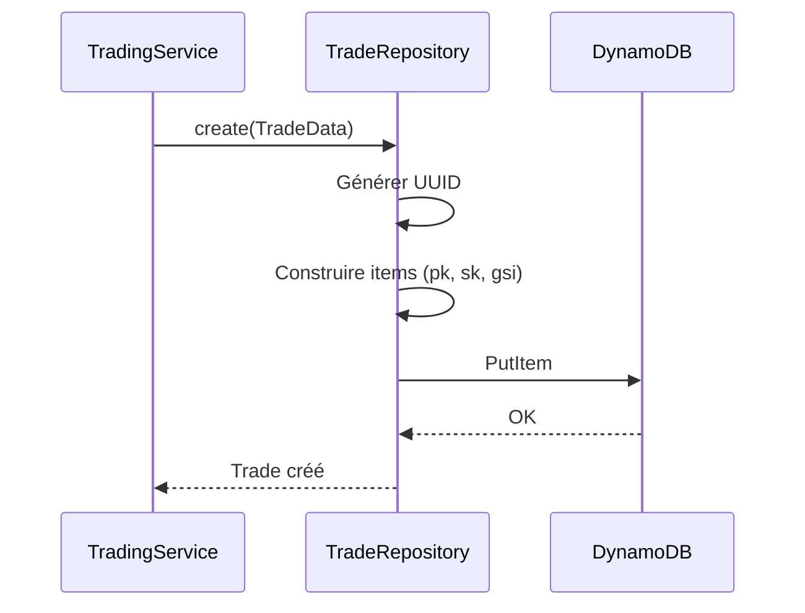
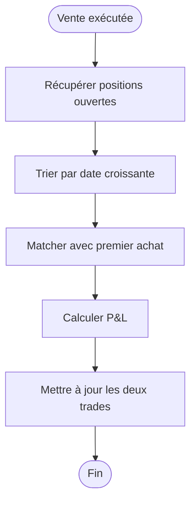

# Historique des Trades

## Vue d'ensemble

Le système d'historique des trades enregistre, stocke et permet de consulter toutes les transactions effectuées par le bot. Il constitue la base pour le calcul des performances et les rapports.

## Objectifs

- Enregistrer chaque trade avec tous ses détails
- Permettre des requêtes efficaces (par date, symbole, type)
- Calculer les métriques de performance (P&L, win rate)
- Fournir les données pour le reporting
- Garantir la traçabilité complète des opérations

## Structure des Données

### Modèle Trade

| Attribut | Type | Description | Exemple |
|----------|------|-------------|---------|
| id | UUID | Identifiant unique interne | `550e8400-e29b-41d4-a716-446655440000` |
| order_id | Number | ID ordre Binance | `123456789` |
| client_order_id | String | ID client unique | `bot_1701864615_abc123` |
| symbol | String | Paire de trading | `BTCUSDT` |
| side | Enum | Direction | `BUY` / `SELL` |
| type | Enum | Type d'ordre | `MARKET` / `LIMIT` |
| status | Enum | Statut de l'ordre | `FILLED` / `CANCELLED` |
| quantity | Decimal | Quantité exécutée | `0.001` |
| price | Decimal | Prix d'exécution moyen | `42500.00` |
| quote_quantity | Decimal | Montant total en quote | `42.50` |
| commission | Decimal | Frais de transaction | `0.0425` |
| commission_asset | String | Devise des frais | `USDT` / `BNB` |
| strategy | String | Stratégie utilisée | `rsi` / `ma` / `combined` |
| signal_value | Decimal | Valeur de l'indicateur | `28.5` (RSI) |
| indicators | JSON | Tous les indicateurs | `{"rsi": 28.5, "ma50": 41200}` |
| pnl | Decimal | Profit/Loss (si vente) | `15.50` |
| pnl_percent | Decimal | P&L en pourcentage | `1.65` |
| related_trade_id | UUID | Trade d'achat lié (si vente) | UUID |
| notes | String | Notes optionnelles | `Manual execution` |
| created_at | Timestamp | Date de création | `2024-12-06T10:30:15Z` |
| updated_at | Timestamp | Dernière mise à jour | `2024-12-06T10:30:16Z` |

### Statuts Possibles

| Statut | Description | Final |
|--------|-------------|-------|
| PENDING | Ordre en attente | Non |
| PARTIALLY_FILLED | Partiellement exécuté | Non |
| FILLED | Entièrement exécuté | Oui |
| CANCELLED | Annulé | Oui |
| REJECTED | Rejeté par Binance | Oui |
| ERROR | Erreur lors de l'exécution | Oui |

## Stockage DynamoDB

### Design Single-Table

| pk | sk | Données |
|----|-----|---------|
| `TRADE#{uuid}` | `METADATA` | Données complètes du trade |
| `TRADE#{uuid}` | `UPDATE#{timestamp}` | Historique des mises à jour |
| `SYMBOL#{symbol}` | `TRADE#{timestamp}#{uuid}` | Index par symbole |
| `DATE#{YYYY-MM-DD}` | `TRADE#{timestamp}#{uuid}` | Index par date |
| `STATUS#{status}` | `TRADE#{timestamp}#{uuid}` | Index par statut |

### Indexes Secondaires Globaux (GSI)

| GSI | Partition Key | Sort Key | Usage |
|-----|---------------|----------|-------|
| gsi1-symbol-date | `gsi1pk` (SYMBOL#X) | `gsi1sk` (timestamp) | Trades par paire |
| gsi2-date | `gsi2pk` (DATE#X) | `gsi2sk` (timestamp) | Trades par jour |
| gsi3-status | `gsi3pk` (STATUS#X) | `gsi3sk` (timestamp) | Trades par statut |

### Exemple d'Enregistrement

```json
{
  "pk": "TRADE#550e8400-e29b-41d4-a716-446655440000",
  "sk": "METADATA",
  "id": "550e8400-e29b-41d4-a716-446655440000",
  "order_id": 123456789,
  "symbol": "BTCUSDT",
  "side": "BUY",
  "type": "MARKET",
  "status": "FILLED",
  "quantity": 0.001,
  "price": 42500.00,
  "quote_quantity": 42.50,
  "commission": 0.0425,
  "commission_asset": "USDT",
  "strategy": "rsi",
  "indicators": {
    "rsi": 28.5,
    "ma50": 41200,
    "ma200": 40800
  },
  "created_at": "2024-12-06T10:30:15Z",
  "gsi1pk": "SYMBOL#BTCUSDT",
  "gsi1sk": "2024-12-06T10:30:15Z",
  "gsi2pk": "DATE#2024-12-06",
  "gsi2sk": "2024-12-06T10:30:15Z",
  "gsi3pk": "STATUS#FILLED",
  "gsi3sk": "2024-12-06T10:30:15Z"
}
```

## Opérations CRUD

### Créer un Trade



### Lire un Trade

```
Query: pk = "TRADE#{id}", sk = "METADATA"
```

### Lister les Trades

#### Par Date

```
GSI: gsi2-date
Query: gsi2pk = "DATE#2024-12-06"
ScanIndexForward: false (plus récent d'abord)
Limit: 50
```

#### Par Symbole

```
GSI: gsi1-symbol-date
Query: gsi1pk = "SYMBOL#BTCUSDT"
KeyCondition: gsi1sk BETWEEN "2024-12-01" AND "2024-12-31"
```

#### Par Statut

```
GSI: gsi3-status
Query: gsi3pk = "STATUS#FILLED"
```

### Mettre à Jour un Trade

Cas d'usage : mise à jour du statut, ajout de P&L après vente.

```
UpdateItem: pk = "TRADE#{id}", sk = "METADATA"
UpdateExpression: SET status = :status, pnl = :pnl, updated_at = :now
```

## Calcul du P&L

### P&L par Trade

Le P&L est calculé lors de la vente en associant au trade d'achat correspondant.

```
P&L = (prix_vente * quantité) - (prix_achat * quantité) - frais_achat - frais_vente
P&L% = (P&L / montant_achat) * 100
```

### Algorithme d'Association

Méthode FIFO (First In, First Out) :



### Positions Ouvertes

Une position est ouverte quand un BUY n'a pas de SELL associé.

```
Query: gsi3pk = "STATUS#FILLED", side = "BUY", related_trade_id = NULL
```

## API de Requête

### Interface TradeRepository

```php
interface TradeRepositoryInterface
{
    // CRUD
    public function create(Trade $trade): Trade;
    public function findById(string $id): ?Trade;
    public function update(Trade $trade): Trade;

    // Requêtes
    public function findByDate(Carbon $date, int $limit = 50): Collection;
    public function findByDateRange(Carbon $from, Carbon $to): Collection;
    public function findBySymbol(string $symbol, int $limit = 50): Collection;
    public function findByStatus(string $status): Collection;

    // Positions
    public function getOpenPositions(string $symbol = null): Collection;

    // Agrégations
    public function countByDate(Carbon $date): int;
    public function sumPnlByDate(Carbon $date): float;
    public function getStatsByPeriod(Carbon $from, Carbon $to): TradeStats;
}
```

### DTO TradeStats

```php
class TradeStats
{
    public int $totalTrades;
    public int $buyCount;
    public int $sellCount;
    public int $winningTrades;
    public int $losingTrades;
    public float $winRate;
    public float $totalPnl;
    public float $totalPnlPercent;
    public float $averagePnl;
    public float $bestTrade;
    public float $worstTrade;
    public float $totalVolume;
    public float $totalFees;
}
```

## Filtres et Pagination

### Paramètres de Filtre

| Paramètre | Type | Description |
|-----------|------|-------------|
| date_from | Date | Date de début |
| date_to | Date | Date de fin |
| symbol | String | Filtrer par paire |
| side | Enum | BUY / SELL / ALL |
| status | Enum | Statut de l'ordre |
| strategy | String | Stratégie utilisée |
| min_amount | Decimal | Montant minimum |
| max_amount | Decimal | Montant maximum |

### Pagination DynamoDB

```php
class PaginatedResult
{
    public Collection $items;
    public ?string $lastEvaluatedKey;
    public bool $hasMore;
}

// Usage
$result = $repo->findByDate($date, limit: 50, exclusiveStartKey: $lastKey);
```

## Export des Données

### Formats Supportés

| Format | Extension | Usage |
|--------|-----------|-------|
| CSV | .csv | Excel, import comptable |
| JSON | .json | API, intégrations |
| PDF | .pdf | Archivage (évolution future) |

### Structure CSV

```csv
id,date,symbol,side,type,quantity,price,total,commission,pnl,strategy
uuid,2024-12-06 10:30:15,BTCUSDT,BUY,MARKET,0.001,42500.00,42.50,0.04,,rsi
uuid,2024-12-06 15:45:00,BTCUSDT,SELL,MARKET,0.001,43200.00,43.20,0.04,0.66,rsi
```

### Commande Artisan

```bash
# Export CSV du jour
php artisan trades:export --format=csv --date=2024-12-06

# Export JSON période
php artisan trades:export --format=json --from=2024-12-01 --to=2024-12-31

# Export par symbole
php artisan trades:export --symbol=BTCUSDT --format=csv
```

## Archivage

### Stratégie de Rétention

| Données | Rétention | Stockage |
|---------|-----------|----------|
| Trades récents (< 90 jours) | Illimitée | DynamoDB |
| Trades anciens (> 90 jours) | 2 ans | DynamoDB + S3 |
| Exports | 1 an | S3 |

### TTL DynamoDB

Pour les données temporaires (logs, sessions) :

```json
{
  "pk": "TRADE_LOG#...",
  "ttl": 1704067200  // Unix timestamp d'expiration
}
```

### Archivage S3

Export mensuel vers S3 pour les trades anciens :

```
s3://trading-bot-{env}-archive/
  trades/
    2024/
      01/
        trades-2024-01.json.gz
      02/
        trades-2024-02.json.gz
```

## Métriques et Dashboard

### Métriques Calculées

| Métrique | Description | Période |
|----------|-------------|---------|
| Total trades | Nombre total de trades | Jour/Semaine/Mois |
| Volume total | Somme des quote_quantity | Jour/Semaine/Mois |
| P&L total | Somme des pnl | Jour/Semaine/Mois |
| Win rate | % trades gagnants | Global |
| Average trade | P&L moyen par trade | Global |
| Largest win | Plus gros gain | Global |
| Largest loss | Plus grosse perte | Global |
| Profit factor | Gains / Pertes | Global |

### Agrégation pour Dashboard

```php
public function getDashboardStats(): array
{
    return [
        'today' => $this->getStatsByPeriod(today(), today()),
        'week' => $this->getStatsByPeriod(now()->startOfWeek(), now()),
        'month' => $this->getStatsByPeriod(now()->startOfMonth(), now()),
        'all_time' => $this->getAllTimeStats(),
    ];
}
```

## Tests

### Tests Unitaires

| Test | Description |
|------|-------------|
| P&L calculation | Vérifier calcul correct |
| FIFO matching | Vérifier association achat/vente |
| Stats aggregation | Vérifier calculs de stats |

### Tests d'Intégration

| Test | Description |
|------|-------------|
| Create trade | Insertion DynamoDB |
| Query by date | Récupération par index |
| Export CSV | Génération fichier correct |

### Fixtures

```php
class TradeFactory extends Factory
{
    public function definition(): array
    {
        return [
            'symbol' => 'BTCUSDT',
            'side' => $this->faker->randomElement(['BUY', 'SELL']),
            'type' => 'MARKET',
            'status' => 'FILLED',
            'quantity' => $this->faker->randomFloat(4, 0.001, 0.1),
            'price' => $this->faker->randomFloat(2, 40000, 50000),
            'strategy' => $this->faker->randomElement(['rsi', 'ma']),
        ];
    }
}
```

## Sécurité

### Accès aux Données

- Authentification requise pour consulter l'historique
- Pas d'accès public aux trades
- Logs d'accès pour audit

### Données Sensibles

- Les order_id Binance sont internes uniquement
- Pas d'exposition des clés API
- Chiffrement au repos (DynamoDB)

## Évolutions Futures

### Court Terme
- Export PDF avec graphiques
- Filtres avancés (indicateurs, P&L range)
- Pagination infinie sur le dashboard

### Moyen Terme
- Analyse de performance détaillée
- Comparaison entre stratégies
- Backtesting sur données historiques

### Long Terme
- Machine Learning sur patterns de trades
- Optimisation automatique des stratégies
- Reporting fiscal automatisé
