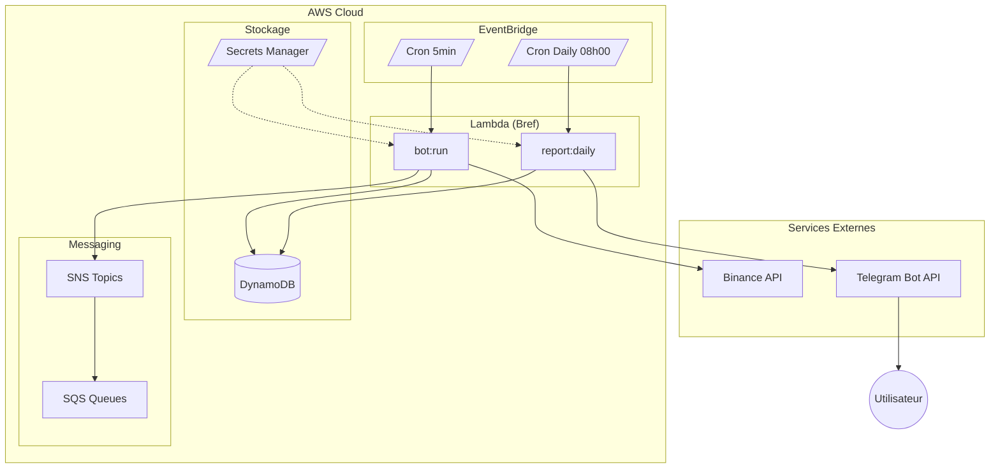
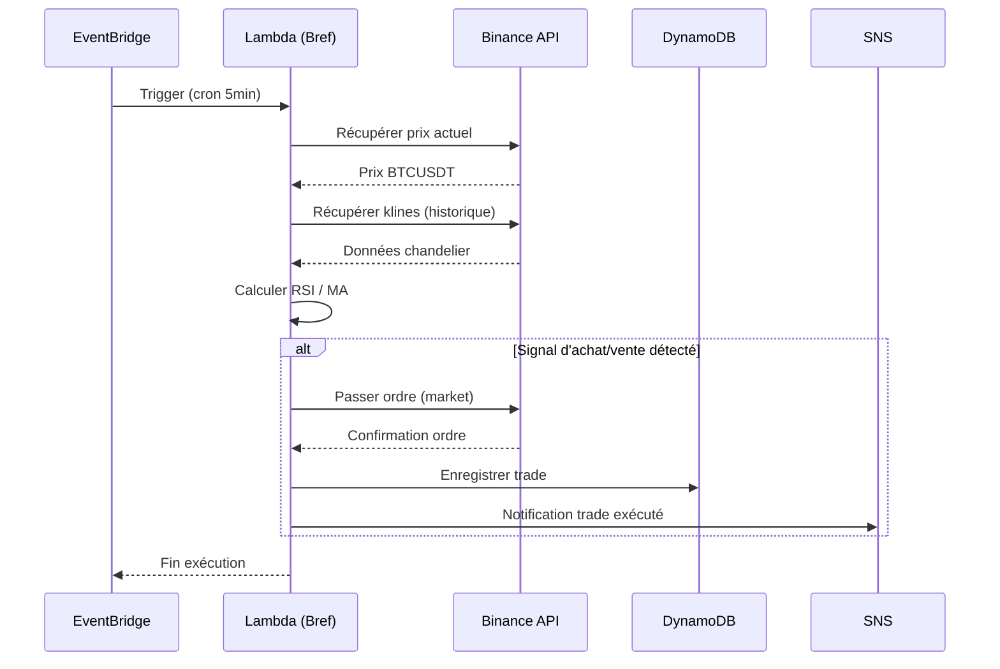
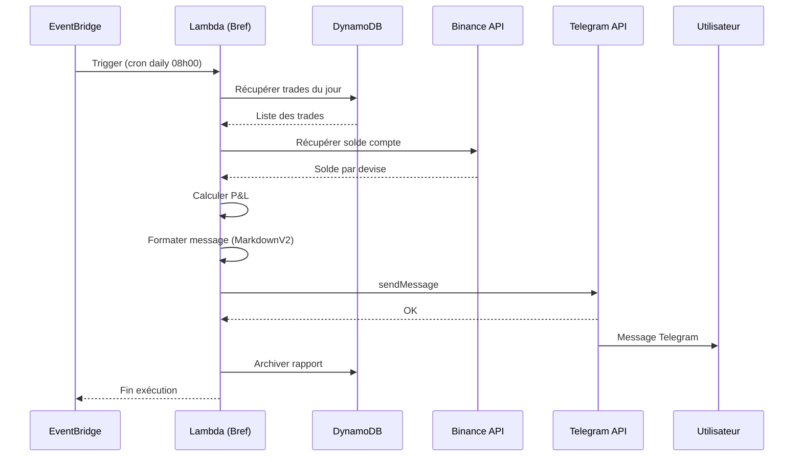

# Architecture de l'Application

## Structure des Fichiers

```
binance-bot/
├── app/
│   ├── Http/Controllers/
│   │   └── BotController.php
│   ├── Models/
│   │   └── Trade.php
│   ├── Services/
│   │   ├── BinanceService.php
│   │   └── TradingStrategy.php
│   └── Console/Commands/
│       └── RunBot.php
├── config/
│   ├── services.php (configuration Binance)
│   └── bot.php (configuration du bot)
├── database/migrations/
│   └── xxxx_create_trades_table.php
├── resources/views/bot/
│   └── dashboard.blade.php
└── routes/
    └── web.php
```

## Composants Principaux

### Service Binance (`BinanceService.php`)
- Connexion à l'API Binance
- Récupération des prix en temps réel
- Gestion des ordres d'achat/vente (market et limit)
- Consultation du solde du compte
- Récupération des données de chandelier (klines)
- Enregistrement automatique des trades en base de données

### Modèle Trade
Enregistre tous les trades avec :
- Symbole (ex: BTCUSDT)
- Type (BUY/SELL)
- Quantité et prix
- Statut (pending, filled, cancelled, error)
- ID de l'ordre Binance
- Horodatage

### Dashboard Web
- Affichage du prix actuel
- Solde du compte
- Historique des 10 derniers trades
- Profit/Perte total
- Bouton ON/OFF pour activer/désactiver le bot
- Exécution manuelle de la stratégie

### Automatisation
- Commande Artisan : `php artisan bot:run`
- Planification via AWS EventBridge (toutes les 5 minutes)
- Logs détaillés des erreurs et actions

### Reporting Quotidien via Telegram
Envoi automatique d'un rapport journalier :
- **Déclencheur** : EventBridge (cron quotidien, ex: 08h00 UTC)
- **Commande** : `php artisan report:daily`
- **Contenu du rapport** :
  - Liste des trades exécutés (achats/ventes)
  - Calcul des gains/pertes (P&L) de la journée
  - Solde actuel du compte Binance (par devise)
  - Performance globale (% variation)
- **Envoi** : Telegram Bot API (HTTPS)
- **Format** : Message formaté en MarkdownV2
- **Stockage** : Historique des rapports en DynamoDB

## Infrastructure AWS

### DynamoDB
Base de données NoSQL pour le stockage des données :
- Table `trades` : historique des transactions
- Table `bot_config` : configuration du bot
- Modèle single-table design recommandé

### SNS (Simple Notification Service)
Notifications et alertes :
- Topic pour les alertes de trading (achat/vente exécuté)
- Topic pour les erreurs critiques
- Intégration possible avec email, SMS, webhooks

### Telegram Bot API
Envoi des rapports quotidiens via Telegram :
- Bot créé via @BotFather
- Appels HTTPS directs à l'API Telegram
- Token stocké dans AWS Secrets Manager
- Pas de dépendance à un service AWS spécifique

### SQS (Simple Queue Service)
Gestion asynchrone des événements :
- Queue pour le traitement des ordres
- Queue pour les mises à jour de prix
- Dead Letter Queue pour les erreurs

### EventBridge
Planification des tâches (remplacement du cron) :
- Règle pour exécuter le bot toutes les 5 minutes
- Règle pour les rapports quotidiens
- Intégration native avec Lambda/ECS

### Architecture Globale



### Flux de Trading (toutes les 5 minutes)



### Flux de Reporting Quotidien



## Déploiement

### Bref (PHP sur Lambda)
- Runtime PHP 8.4 pour AWS Lambda
- Intégration Laravel native via `bref/laravel-bridge`
- Configuration dans `serverless.yml` ou via Terraform

### Terraform
Infrastructure as Code dans `terraform/` :
- Définition des ressources AWS
- Gestion des environnements (dev, staging, prod)
- État distant sur S3

### GitHub Actions
Pipeline CI/CD automatisé :
- Tests automatiques sur PR
- Déploiement sur push vers `main`
- Terraform plan/apply
- Déploiement Lambda via Bref
