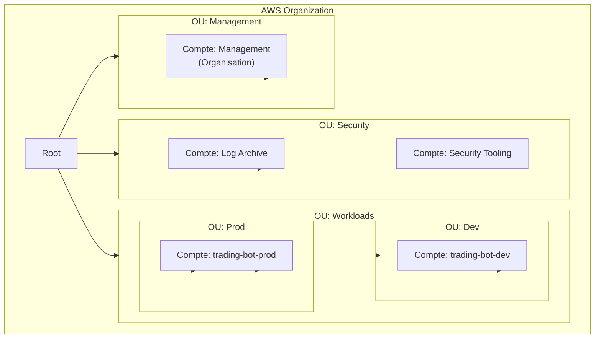

# AWS Organizations - Structure Multi-Compte

## Vue d'ensemble

AWS Organizations permet de gérer plusieurs comptes AWS de manière centralisée. Cette structure isole les environnements, améliore la sécurité et facilite la gouvernance.

## Pourquoi Multi-Compte ?

| Avantage | Description |
|----------|-------------|
| Isolation | Séparation des environnements (dev/staging/prod) |
| Sécurité | Blast radius limité en cas de compromission |
| Quotas | Limites de service indépendantes par compte |
| Facturation | Coûts séparés et traçables par environnement |
| Conformité | Policies différentes selon l'environnement |

## Structure Recommandée



## Comptes AWS

### Structure Minimale (Free Tier)

Pour rester dans le Free Tier, utiliser une structure simplifiée :

| Compte | Usage | OU |
|--------|-------|-----|
| **Management** | Organisation, facturation consolidée | Root |
| **trading-bot-dev** | Développement et tests | Workloads/Dev |
| **trading-bot-prod** | Production | Workloads/Prod |

### Structure Complète (Évolution future)

| Compte | Usage | OU |
|--------|-------|-----|
| Management | Organisation, facturation | Root |
| Log Archive | Logs centralisés (CloudTrail, Config) | Security |
| Security Tooling | GuardDuty, Security Hub | Security |
| trading-bot-dev | Développement | Workloads/Dev |
| trading-bot-staging | Pré-production | Workloads/Staging |
| trading-bot-prod | Production | Workloads/Prod |

## Organizational Units (OUs)

### Hiérarchie Recommandée

```
Root
├── Security
│   ├── Log Archive
│   └── Security Tooling
├── Workloads
│   ├── Dev
│   ├── Staging (optionnel)
│   └── Prod
└── Sandbox (optionnel)
```

### Principes de Design

1. **Simplicité** : Éviter plus de 3 niveaux de profondeur
2. **Fonction > Structure** : Organiser par fonction, pas par organigramme
3. **Isolation** : Séparer prod des autres environnements

## Service Control Policies (SCPs)

### SCP pour l'OU Prod

Restrictions de sécurité pour la production :

- Interdire la suppression des logs CloudTrail
- Interdire la désactivation de Config
- Limiter les régions autorisées
- Interdire la création de ressources hors Free Tier (optionnel)

### SCP pour l'OU Dev

Permissions plus souples pour le développement :

- Accès à toutes les régions
- Création de ressources expérimentales
- Budget limité via AWS Budgets

## IAM Identity Center (SSO)

### Groupes Recommandés

| Groupe | Accès Dev | Accès Prod |
|--------|-----------|------------|
| Developers | AdministratorAccess | ReadOnlyAccess |
| Admins | AdministratorAccess | AdministratorAccess |
| Billing | ViewOnlyAccess | ViewOnlyAccess |

### Permission Sets

| Permission Set | Description |
|----------------|-------------|
| AdministratorAccess | Accès complet |
| ReadOnlyAccess | Lecture seule |
| DeployerAccess | CI/CD (Lambda, DynamoDB, etc.) |

## Facturation Consolidée

### Avantages

- Une seule facture pour tous les comptes
- Agrégation du Free Tier (attention : partagé entre comptes)
- Tarifs dégressifs cumulés

### Configuration

1. Activer la facturation consolidée dans le compte Management
2. Configurer AWS Budgets pour alertes
3. Utiliser Cost Allocation Tags pour le suivi

### Free Tier et Multi-Compte

**Attention** : Le Free Tier est **partagé** entre tous les comptes de l'organisation.

| Service | Limite Totale Org |
|---------|-------------------|
| Lambda | 1M requêtes/mois (tous comptes) |
| DynamoDB | 25 GB + 25 RCU/WCU (tous comptes) |
| etc. | ... |

**Recommandation** : Limiter l'usage dev pour préserver le Free Tier prod.

## Terraform avec Organizations

### Structure des Fichiers

```
terraform/
├── organization/           # Ressources Organization (compte Management)
│   ├── main.tf
│   ├── accounts.tf
│   ├── ous.tf
│   └── scps.tf
├── environments/
│   ├── dev/               # Ressources compte dev
│   └── prod/              # Ressources compte prod
└── modules/
```

### Providers Multi-Compte

Utiliser des providers avec assume_role pour déployer dans chaque compte.

## GitHub Actions avec Organizations

### Secrets par Environnement

```
Secrets pour environnement "dev":
- AWS_ACCESS_KEY_ID_DEV
- AWS_SECRET_ACCESS_KEY_DEV
- AWS_ACCOUNT_ID_DEV

Secrets pour environnement "prod":
- AWS_ACCESS_KEY_ID_PROD
- AWS_SECRET_ACCESS_KEY_PROD
- AWS_ACCOUNT_ID_PROD
```

### Workflow Multi-Compte

1. Push vers `develop` → Déploiement compte Dev
2. Push vers `main` → Déploiement compte Prod (avec approbation)

## Mise en Place

### Étape 1 : Créer l'Organisation

1. Connectez-vous au compte qui deviendra le Management Account
2. Accéder à AWS Organizations
3. Créer l'organisation

### Étape 2 : Créer les OUs

1. Créer OU "Workloads"
2. Créer sous-OU "Dev" dans Workloads
3. Créer sous-OU "Prod" dans Workloads

### Étape 3 : Créer les Comptes Membres

1. Créer le compte trading-bot-dev
2. Créer le compte trading-bot-prod
3. Déplacer chaque compte dans son OU

### Étape 4 : Configurer IAM Identity Center

1. Activer IAM Identity Center
2. Créer les groupes (Developers, Admins)
3. Créer les Permission Sets
4. Assigner les groupes aux comptes

### Étape 5 : Appliquer les SCPs

1. Créer les SCPs de sécurité
2. Attacher aux OUs appropriées

## Bonnes Pratiques

### Sécurité

- Ne jamais utiliser le compte Management pour les workloads
- Activer MFA sur tous les utilisateurs root
- Utiliser IAM Identity Center (pas d'utilisateurs IAM locaux)
- Activer CloudTrail au niveau de l'organisation

### Gouvernance

- Documenter la structure des comptes
- Processus de création de compte formalisé
- Revue régulière des accès
- Tags obligatoires sur toutes les ressources

### Coûts

- AWS Budgets par compte
- Alertes à 50%, 80%, 100% du budget
- Revue mensuelle des coûts

## Ressources

- [AWS Organizations Best Practices](https://docs.aws.amazon.com/organizations/latest/userguide/orgs_best-practices.html)
- [Organizing Your AWS Environment](https://docs.aws.amazon.com/whitepapers/latest/organizing-your-aws-environment/organizing-your-aws-environment.html)
- [Multi-Account Strategy for SMB](https://aws.amazon.com/blogs/mt/multi-account-strategy-for-small-and-medium-businesses/)
- [Best Practices for OUs](https://aws.amazon.com/blogs/mt/best-practices-for-organizational-units-with-aws-organizations/)
