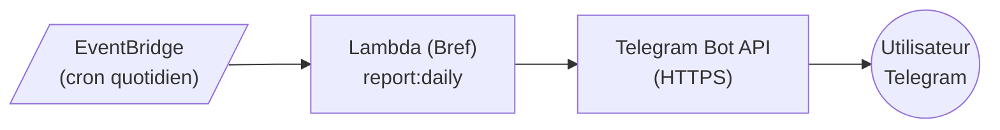

# Telegram Bot - Reporting Quotidien

## Vue d'ensemble

Telegram Bot API est utilisé pour envoyer le reporting quotidien du bot de trading. Solution gratuite, simple à implémenter, sans processus de validation.

## Architecture



## Prérequis

### Création du Bot

1. Ouvrir Telegram et rechercher **@BotFather**
2. Envoyer la commande `/newbot`
3. Suivre les instructions :
   - Nom du bot (affiché aux utilisateurs)
   - Username du bot (doit finir par `bot`, ex: `TradingReportBot`)
4. BotFather renvoie le **token d'API** : `123456789:ABCdefGHIjklMNOpqrsTUVwxyz`

### Récupération du Chat ID

Pour envoyer des messages, il faut le `chat_id` du destinataire :

1. Démarrer une conversation avec le bot (commande `/start`)
2. Appeler l'endpoint `getUpdates` pour récupérer le chat_id
3. Le chat_id est dans la réponse JSON : `result[0].message.chat.id`

**Types de chat_id** :
| Type | Format | Exemple |
|------|--------|---------|
| Utilisateur privé | Nombre positif | `123456789` |
| Groupe | Nombre négatif | `-987654321` |
| Channel | Nombre négatif avec préfixe | `-1001234567890` |

## API Telegram

### Endpoint Base

```
https://api.telegram.org/bot<TOKEN>/<METHOD>
```

### Méthodes Principales

| Méthode | Description |
|---------|-------------|
| `getMe` | Informations sur le bot |
| `getUpdates` | Récupérer les messages entrants (polling) |
| `sendMessage` | Envoyer un message texte |
| `sendDocument` | Envoyer un fichier |
| `sendPhoto` | Envoyer une image |
| `setWebhook` | Configurer un webhook |

### Paramètres sendMessage

| Paramètre | Type | Requis | Description |
|-----------|------|--------|-------------|
| `chat_id` | Integer/String | Oui | ID du chat destinataire |
| `text` | String | Oui | Contenu du message (max 4096 caractères) |
| `parse_mode` | String | Non | Format : `Markdown`, `MarkdownV2`, `HTML` |
| `disable_notification` | Boolean | Non | Envoi silencieux |
| `disable_web_page_preview` | Boolean | Non | Désactiver les previews de liens |

### Formatage des Messages

**MarkdownV2** (recommandé) :
| Syntaxe | Rendu |
|---------|-------|
| `*bold*` | **bold** |
| `_italic_` | _italic_ |
| `__underline__` | underline |
| `~strikethrough~` | ~~strikethrough~~ |
| `` `code` `` | `code` |
| ```` ```code block``` ```` | bloc de code |
| `[link](url)` | lien cliquable |

**HTML** :
| Balise | Rendu |
|--------|-------|
| `<b>` | bold |
| `<i>` | italic |
| `<u>` | underline |
| `<code>` | code inline |
| `<pre>` | bloc de code |
| `<a href="url">` | lien |

### Exemple de Message de Reporting

```
📊 *Rapport Trading \- 06/12/2024*

*Trades du jour :*
• 🟢 BUY 0\.001 BTC @ 42,500 USDT
• 🔴 SELL 0\.001 BTC @ 43,200 USDT

*Performance :*
• P&L : \+700 USDT
• Variation : \+1\.6%

*Solde actuel :*
• BTC : 0\.5
• USDT : 12,500

_Généré automatiquement par Trading Bot_
```

Note : En MarkdownV2, les caractères spéciaux doivent être échappés avec `\`

## Configuration

### Variables d'Environnement

```env
# Telegram Bot
TELEGRAM_BOT_TOKEN=123456789:ABCdefGHIjklMNOpqrsTUVwxyz
TELEGRAM_CHAT_ID=987654321
```

### SSM Parameter Store (recommandé pour production)

Stocker le token dans SSM Parameter Store (gratuit, Free Tier) :
- `/trading-bot/{env}/telegram/bot_token` (SecureString)
- `/trading-bot/{env}/telegram/chat_id` (String)

## Intégration Laravel

### Structure

```
app/Services/
└── Notification/
    └── TelegramService.php
```

### Fonctionnalités du Service

- Envoi de message texte simple
- Envoi de message formaté (Markdown/HTML)
- Envoi de document (rapport PDF)
- Gestion des erreurs et retry
- Logging des envois

### Commande Artisan

```bash
php artisan report:daily
php artisan report:daily --dry-run  # Test sans envoi
```

## Limites et Quotas

### Limites de l'API

| Limite | Valeur |
|--------|--------|
| Taille message | 4096 caractères |
| Taille fichier | 50 MB (standard) |
| Messages/seconde (même chat) | 1 msg/sec |
| Messages/minute (broadcast) | 30 msg/sec |
| Requêtes API | Pas de limite stricte |

### Bonnes Pratiques

- Respecter le rate limit de 1 msg/sec par chat
- Utiliser des délais entre les envois en masse
- Implémenter un retry avec backoff exponentiel
- Ne pas envoyer de messages non sollicités (spam)

## Gestion des Erreurs

### Codes d'Erreur Courants

| Code | Description | Action |
|------|-------------|--------|
| 400 | Bad Request (paramètres invalides) | Vérifier les paramètres |
| 401 | Unauthorized (token invalide) | Vérifier le token |
| 403 | Forbidden (bot bloqué par l'utilisateur) | L'utilisateur doit débloquer |
| 429 | Too Many Requests | Attendre et retry |
| 502/504 | Telegram indisponible | Retry avec backoff |

### Retry Strategy

- Tentatives : 3 maximum
- Backoff : exponentiel (1s, 2s, 4s)
- Erreurs non-retry : 400, 401, 403

## Sécurité

### Protection du Token

- Ne jamais commiter le token dans le code
- Utiliser les variables d'environnement ou Secrets Manager
- Rotation périodique possible via BotFather (`/revoke`)

### Validation des Entrées

- Échapper les caractères spéciaux pour MarkdownV2
- Limiter la taille des messages
- Valider le format du chat_id

## Webhook vs Polling

Pour le reporting (envoi uniquement), le webhook n'est pas nécessaire.

| Méthode | Usage | Notre cas |
|---------|-------|-----------|
| Polling (getUpdates) | Recevoir des messages | Non utilisé |
| Webhook | Recevoir des messages en temps réel | Non utilisé |
| Appel API direct | Envoyer des messages | ✅ Utilisé |

## Monitoring

### Métriques à Surveiller

- Taux de succès des envois
- Latence de l'API Telegram
- Erreurs par type (4xx, 5xx)

### Alertes Recommandées

- Échec d'envoi du rapport quotidien
- Token invalide (401)
- Rate limiting fréquent (429)

## Alternatives et Fallback

En cas d'indisponibilité de Telegram :
- Fallback vers Email (SES)
- Stockage du rapport en DynamoDB pour envoi ultérieur
- Notification d'échec via SNS

## Terraform

### Ressources

```
# SSM Parameter Store pour le token (Free Tier)
/trading-bot/{env}/telegram/bot_token
/trading-bot/{env}/telegram/chat_id

# EventBridge rule pour le cron
trading-bot-{env}-rule-daily-report
```

## Ressources

- [Telegram Bot API Documentation](https://core.telegram.org/bots/api)
- [BotFather](https://t.me/botfather)
- [Telegram Bot API Changelog](https://core.telegram.org/bots/api-changelog)
- [Formatting Options](https://core.telegram.org/bots/api#formatting-options)
