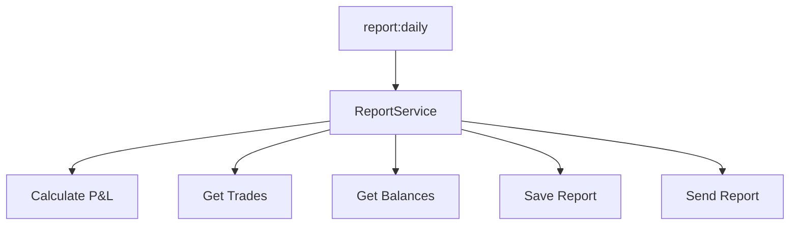

# Task 2.11 - ReportService (calcul P&L, génération rapport)

## Objectif

Créer le service de génération des rapports : calcul du P&L, agrégation des données, génération du rapport quotidien.

## Fichiers à créer

| Fichier | Description |
|---------|-------------|
| `app/Contracts/ReportServiceInterface.php` | Interface du service |
| `app/Services/Report/ReportService.php` | Service de reporting |
| `app/Services/Report/PnlCalculator.php` | Calculateur de P&L |

## Architecture



## Implémentation

### 1. Interface ReportServiceInterface

**Créer** : `app/Contracts/ReportServiceInterface.php`

```php
<?php

declare(strict_types=1);

namespace App\Contracts;

use App\DTOs\DailyReportDTO;
use App\DTOs\TradeStatsDTO;
use Carbon\CarbonInterface;

interface ReportServiceInterface
{
    /**
     * Génère le rapport quotidien.
     */
    public function generateDailyReport(?CarbonInterface $date = null): DailyReportDTO;

    /**
     * Envoie le rapport quotidien via Telegram.
     */
    public function sendDailyReport(DailyReportDTO $report): ?int;

    /**
     * Génère et envoie le rapport quotidien.
     */
    public function generateAndSendDailyReport(?CarbonInterface $date = null): DailyReportDTO;

    /**
     * Calcule les statistiques pour une période.
     */
    public function getStatsForPeriod(CarbonInterface $from, CarbonInterface $to): TradeStatsDTO;

    /**
     * Récupère le rapport d'un jour spécifique (depuis le cache/DB).
     */
    public function getReport(CarbonInterface $date): ?DailyReportDTO;
}
```

### 2. PnlCalculator

**Créer** : `app/Services/Report/PnlCalculator.php`

```php
<?php

declare(strict_types=1);

namespace App\Services\Report;

use App\DTOs\TradeStatsDTO;
use Illuminate\Support\Collection;

final class PnlCalculator
{
    /**
     * Calcule le P&L pour une collection de trades.
     *
     * Utilise la méthode FIFO (First In, First Out) pour associer
     * les achats et les ventes.
     */
    public function calculatePnl(Collection $trades): TradeStatsDTO
    {
        if ($trades->isEmpty()) {
            return TradeStatsDTO::empty();
        }

        $buyTrades = $trades->where('side', 'BUY')->sortBy('created_at');
        $sellTrades = $trades->where('side', 'SELL')->sortBy('created_at');

        $pnls = [];
        $remainingBuys = $buyTrades->values()->toArray();

        foreach ($sellTrades as $sell) {
            $pnl = $this->calculateSellPnl($sell, $remainingBuys);
            if ($pnl !== null) {
                $pnls[] = $pnl;
            }
        }

        return $this->buildStats($trades, $pnls);
    }

    /**
     * Calcule le P&L d'une vente en associant avec les achats FIFO.
     */
    private function calculateSellPnl(array $sell, array &$remainingBuys): ?array
    {
        $sellQty = (float) $sell['quantity'];
        $sellPrice = (float) $sell['price'];
        $sellTotal = $sellQty * $sellPrice;

        $buyTotal = 0.0;
        $matchedQty = 0.0;
        $matchedBuys = [];

        foreach ($remainingBuys as $key => $buy) {
            if ($matchedQty >= $sellQty) {
                break;
            }

            $buyQty = (float) $buy['quantity'];
            $buyPrice = (float) $buy['price'];

            // Quantité à matcher
            $qtyToMatch = min($buyQty, $sellQty - $matchedQty);
            $buyTotal += $qtyToMatch * $buyPrice;
            $matchedQty += $qtyToMatch;

            // Mettre à jour ou supprimer l'achat
            if ($qtyToMatch >= $buyQty) {
                unset($remainingBuys[$key]);
            } else {
                $remainingBuys[$key]['quantity'] = $buyQty - $qtyToMatch;
            }

            $matchedBuys[] = $buy['id'] ?? null;
        }

        if ($matchedQty === 0.0) {
            return null;
        }

        // Calculer le P&L
        $pnl = $sellTotal - $buyTotal;

        // Soustraire les frais
        $sellFees = (float) ($sell['commission'] ?? 0);
        $buyFees = 0.0; // Les frais d'achat sont déjà comptabilisés

        $netPnl = $pnl - $sellFees - $buyFees;
        $pnlPercent = $buyTotal > 0 ? ($netPnl / $buyTotal) * 100 : 0;

        return [
            'sell_id' => $sell['id'] ?? null,
            'matched_buy_ids' => $matchedBuys,
            'sell_total' => $sellTotal,
            'buy_total' => $buyTotal,
            'gross_pnl' => $pnl,
            'fees' => $sellFees,
            'net_pnl' => $netPnl,
            'pnl_percent' => $pnlPercent,
        ];
    }

    /**
     * Construit les statistiques à partir des données calculées.
     */
    private function buildStats(Collection $trades, array $pnls): TradeStatsDTO
    {
        $totalPnl = 0.0;
        $winningTrades = 0;
        $losingTrades = 0;
        $pnlValues = [];

        foreach ($pnls as $pnl) {
            $netPnl = $pnl['net_pnl'];
            $totalPnl += $netPnl;
            $pnlValues[] = $netPnl;

            if ($netPnl > 0) {
                $winningTrades++;
            } elseif ($netPnl < 0) {
                $losingTrades++;
            }
        }

        $totalTrades = $trades->count();
        $buyCount = $trades->where('side', 'BUY')->count();
        $sellCount = $trades->where('side', 'SELL')->count();
        $tradesWithPnl = count($pnlValues);
        $totalVolume = $trades->sum('quote_quantity');
        $totalFees = $trades->sum('commission');

        return new TradeStatsDTO(
            totalTrades: $totalTrades,
            buyCount: $buyCount,
            sellCount: $sellCount,
            winningTrades: $winningTrades,
            losingTrades: $losingTrades,
            winRate: $tradesWithPnl > 0 ? ($winningTrades / $tradesWithPnl) * 100 : 0.0,
            totalPnl: $totalPnl,
            totalPnlPercent: $totalVolume > 0 ? ($totalPnl / $totalVolume) * 100 : 0.0,
            averagePnl: $tradesWithPnl > 0 ? $totalPnl / $tradesWithPnl : 0.0,
            bestTrade: !empty($pnlValues) ? max($pnlValues) : 0.0,
            worstTrade: !empty($pnlValues) ? min($pnlValues) : 0.0,
            totalVolume: $totalVolume,
            totalFees: $totalFees,
        );
    }

    /**
     * Calcule le P&L simple (sans FIFO) pour un trade de vente.
     */
    public function calculateSimplePnl(float $buyPrice, float $sellPrice, float $quantity, float $fees = 0): array
    {
        $buyTotal = $buyPrice * $quantity;
        $sellTotal = $sellPrice * $quantity;
        $grossPnl = $sellTotal - $buyTotal;
        $netPnl = $grossPnl - $fees;
        $pnlPercent = $buyTotal > 0 ? ($netPnl / $buyTotal) * 100 : 0;

        return [
            'buy_total' => $buyTotal,
            'sell_total' => $sellTotal,
            'gross_pnl' => $grossPnl,
            'fees' => $fees,
            'net_pnl' => $netPnl,
            'pnl_percent' => $pnlPercent,
        ];
    }
}
```

### 3. ReportService

**Créer** : `app/Services/Report/ReportService.php`

```php
<?php

declare(strict_types=1);

namespace App\Services\Report;

use App\Contracts\BinanceServiceInterface;
use App\Contracts\ReportRepositoryInterface;
use App\Contracts\ReportServiceInterface;
use App\Contracts\TelegramServiceInterface;
use App\Contracts\TradeRepositoryInterface;
use App\DTOs\BalanceDTO;
use App\DTOs\DailyReportDTO;
use App\DTOs\TradeResultDTO;
use App\DTOs\TradeStatsDTO;
use Carbon\Carbon;
use Carbon\CarbonInterface;
use Illuminate\Support\Collection;
use Illuminate\Support\Facades\Log;

final class ReportService implements ReportServiceInterface
{
    public function __construct(
        private readonly TradeRepositoryInterface $tradeRepository,
        private readonly ReportRepositoryInterface $reportRepository,
        private readonly BinanceServiceInterface $binanceService,
        private readonly TelegramServiceInterface $telegramService,
        private readonly PnlCalculator $pnlCalculator,
    ) {}

    public function generateDailyReport(?CarbonInterface $date = null): DailyReportDTO
    {
        $date = $date ? Carbon::instance($date) : Carbon::yesterday();
        $date = $date->startOfDay();

        Log::info('Generating daily report', ['date' => $date->toDateString()]);

        // Récupérer les trades du jour
        $trades = $this->tradeRepository->findByDate($date);

        // Calculer les statistiques avec P&L
        $stats = $this->pnlCalculator->calculatePnl($trades);

        // Récupérer les soldes actuels
        $balances = $this->binanceService->getAccountBalances();

        // Calculer la valeur totale en USDT
        $totalBalanceUsdt = $this->calculateTotalBalanceUsdt($balances);

        // Récupérer le solde de la veille (depuis le rapport précédent)
        $previousDayBalance = $this->getPreviousDayBalance($date);

        // Convertir les trades en DTOs
        $tradeDtos = $this->convertTradesToDtos($trades);

        return new DailyReportDTO(
            date: $date->toImmutable(),
            stats: $stats,
            trades: $tradeDtos,
            balances: $balances->toArray(),
            totalBalanceUsdt: $totalBalanceUsdt,
            previousDayBalanceUsdt: $previousDayBalance,
        );
    }

    public function sendDailyReport(DailyReportDTO $report): ?int
    {
        try {
            $messageId = $this->telegramService->sendDailyReport($report);

            // Sauvegarder le rapport en base
            $this->reportRepository->saveDailyReport($report, $messageId);

            Log::info('Daily report sent and saved', [
                'date' => $report->date->toDateString(),
                'telegram_message_id' => $messageId,
            ]);

            return $messageId;

        } catch (\Exception $e) {
            Log::error('Failed to send daily report', [
                'date' => $report->date->toDateString(),
                'error' => $e->getMessage(),
            ]);

            // Sauvegarder quand même le rapport sans l'ID Telegram
            $this->reportRepository->saveDailyReport($report);

            throw $e;
        }
    }

    public function generateAndSendDailyReport(?CarbonInterface $date = null): DailyReportDTO
    {
        $report = $this->generateDailyReport($date);

        // Vérifier si le rapport existe déjà
        $date = $date ? Carbon::instance($date)->startOfDay() : Carbon::yesterday()->startOfDay();

        if ($this->reportRepository->existsForDate($date)) {
            Log::warning('Daily report already exists', ['date' => $date->toDateString()]);
            // Envoyer quand même (peut être un re-envoi manuel)
        }

        $this->sendDailyReport($report);

        return $report;
    }

    public function getStatsForPeriod(CarbonInterface $from, CarbonInterface $to): TradeStatsDTO
    {
        $trades = $this->tradeRepository->findByDateRange($from, $to);

        return $this->pnlCalculator->calculatePnl($trades);
    }

    public function getReport(CarbonInterface $date): ?DailyReportDTO
    {
        $reportData = $this->reportRepository->findByDate($date);

        if ($reportData === null) {
            return null;
        }

        // Reconstruire le DTO depuis les données stockées
        return new DailyReportDTO(
            date: Carbon::parse($reportData['date'])->toImmutable(),
            stats: new TradeStatsDTO(
                totalTrades: $reportData['stats']['total_trades'] ?? 0,
                buyCount: $reportData['stats']['buy_count'] ?? 0,
                sellCount: $reportData['stats']['sell_count'] ?? 0,
                winningTrades: $reportData['stats']['winning_trades'] ?? 0,
                losingTrades: $reportData['stats']['losing_trades'] ?? 0,
                winRate: $reportData['stats']['win_rate'] ?? 0.0,
                totalPnl: $reportData['stats']['total_pnl'] ?? 0.0,
                totalPnlPercent: $reportData['stats']['total_pnl_percent'] ?? 0.0,
                averagePnl: $reportData['stats']['average_pnl'] ?? 0.0,
                bestTrade: $reportData['stats']['best_trade'] ?? 0.0,
                worstTrade: $reportData['stats']['worst_trade'] ?? 0.0,
                totalVolume: $reportData['stats']['total_volume'] ?? 0.0,
                totalFees: $reportData['stats']['total_fees'] ?? 0.0,
            ),
            trades: [],
            balances: [],
            totalBalanceUsdt: $reportData['total_balance_usdt'] ?? 0.0,
            previousDayBalanceUsdt: $reportData['previous_day_balance_usdt'] ?? null,
        );
    }

    /**
     * Calcule la valeur totale du portefeuille en USDT.
     *
     * @param Collection<int, BalanceDTO> $balances
     */
    private function calculateTotalBalanceUsdt(Collection $balances): float
    {
        $total = 0.0;

        foreach ($balances as $balance) {
            if ($balance->asset === 'USDT') {
                $total += $balance->total();
            } elseif ($balance->isSignificant()) {
                // Convertir en USDT via le prix actuel
                try {
                    $symbol = $balance->asset . 'USDT';
                    $price = $this->binanceService->getCurrentPrice($symbol);
                    $total += $balance->total() * $price;
                } catch (\Exception $e) {
                    // Ignorer les actifs non convertibles
                    Log::debug('Could not convert asset to USDT', [
                        'asset' => $balance->asset,
                        'error' => $e->getMessage(),
                    ]);
                }
            }
        }

        return $total;
    }

    /**
     * Récupère le solde de la veille depuis le rapport précédent.
     */
    private function getPreviousDayBalance(CarbonInterface $date): ?float
    {
        $previousDay = Carbon::instance($date)->subDay();
        $previousReport = $this->reportRepository->findByDate($previousDay);

        return $previousReport['total_balance_usdt'] ?? null;
    }

    /**
     * Convertit les données de trades en DTOs.
     *
     * @return array<TradeResultDTO>
     */
    private function convertTradesToDtos(Collection $trades): array
    {
        return $trades->map(function (array $trade) {
            return TradeResultDTO::fromArray($trade);
        })->toArray();
    }
}
```

### 4. Enregistrement dans le Service Provider

**Modifier** : `app/Providers/AppServiceProvider.php`

```php
// Ajouter dans les bindings
public array $bindings = [
    // ... autres bindings
    ReportServiceInterface::class => ReportService::class,
];

// Ajouter dans register()
public function register(): void
{
    // ... code existant

    $this->app->singleton(PnlCalculator::class);
}
```

## Tests

**Créer** : `tests/Unit/Services/Report/PnlCalculatorTest.php`

```php
<?php

declare(strict_types=1);

namespace Tests\Unit\Services\Report;

use App\Services\Report\PnlCalculator;
use Illuminate\Support\Collection;
use Tests\TestCase;

final class PnlCalculatorTest extends TestCase
{
    private PnlCalculator $calculator;

    protected function setUp(): void
    {
        parent::setUp();
        $this->calculator = new PnlCalculator();
    }

    public function test_calculate_pnl_with_simple_trade(): void
    {
        $trades = new Collection([
            [
                'id' => 'buy-1',
                'side' => 'BUY',
                'quantity' => 0.001,
                'price' => 40000,
                'quote_quantity' => 40,
                'commission' => 0.04,
                'created_at' => '2024-12-06T10:00:00Z',
            ],
            [
                'id' => 'sell-1',
                'side' => 'SELL',
                'quantity' => 0.001,
                'price' => 42000,
                'quote_quantity' => 42,
                'commission' => 0.04,
                'created_at' => '2024-12-06T15:00:00Z',
            ],
        ]);

        $stats = $this->calculator->calculatePnl($trades);

        // P&L = (42000 - 40000) * 0.001 - 0.04 = 2 - 0.04 = 1.96
        $this->assertEqualsWithDelta(1.96, $stats->totalPnl, 0.01);
        $this->assertEquals(1, $stats->winningTrades);
        $this->assertEquals(0, $stats->losingTrades);
    }

    public function test_calculate_pnl_with_losing_trade(): void
    {
        $trades = new Collection([
            [
                'id' => 'buy-1',
                'side' => 'BUY',
                'quantity' => 0.001,
                'price' => 45000,
                'quote_quantity' => 45,
                'commission' => 0.04,
                'created_at' => '2024-12-06T10:00:00Z',
            ],
            [
                'id' => 'sell-1',
                'side' => 'SELL',
                'quantity' => 0.001,
                'price' => 42000,
                'quote_quantity' => 42,
                'commission' => 0.04,
                'created_at' => '2024-12-06T15:00:00Z',
            ],
        ]);

        $stats = $this->calculator->calculatePnl($trades);

        // P&L = (42000 - 45000) * 0.001 - 0.04 = -3 - 0.04 = -3.04
        $this->assertEqualsWithDelta(-3.04, $stats->totalPnl, 0.01);
        $this->assertEquals(0, $stats->winningTrades);
        $this->assertEquals(1, $stats->losingTrades);
    }

    public function test_calculate_pnl_with_multiple_buys_fifo(): void
    {
        $trades = new Collection([
            [
                'id' => 'buy-1',
                'side' => 'BUY',
                'quantity' => 0.001,
                'price' => 40000,
                'quote_quantity' => 40,
                'commission' => 0.04,
                'created_at' => '2024-12-06T10:00:00Z',
            ],
            [
                'id' => 'buy-2',
                'side' => 'BUY',
                'quantity' => 0.001,
                'price' => 41000,
                'quote_quantity' => 41,
                'commission' => 0.04,
                'created_at' => '2024-12-06T11:00:00Z',
            ],
            [
                'id' => 'sell-1',
                'side' => 'SELL',
                'quantity' => 0.001,
                'price' => 42000,
                'quote_quantity' => 42,
                'commission' => 0.04,
                'created_at' => '2024-12-06T15:00:00Z',
            ],
        ]);

        $stats = $this->calculator->calculatePnl($trades);

        // FIFO: première vente matche le premier achat (40000)
        // P&L = (42000 - 40000) * 0.001 - 0.04 = 2 - 0.04 = 1.96
        $this->assertEqualsWithDelta(1.96, $stats->totalPnl, 0.01);
    }

    public function test_calculate_pnl_empty_trades(): void
    {
        $trades = new Collection([]);

        $stats = $this->calculator->calculatePnl($trades);

        $this->assertEquals(0, $stats->totalTrades);
        $this->assertEquals(0.0, $stats->totalPnl);
    }

    public function test_calculate_simple_pnl(): void
    {
        $result = $this->calculator->calculateSimplePnl(
            buyPrice: 40000,
            sellPrice: 42000,
            quantity: 0.001,
            fees: 0.08,
        );

        $this->assertEqualsWithDelta(2.0, $result['gross_pnl'], 0.01);
        $this->assertEqualsWithDelta(1.92, $result['net_pnl'], 0.01);
    }
}
```

## Utilisation

```php
use App\Contracts\ReportServiceInterface;

class ReportController
{
    public function __construct(
        private readonly ReportServiceInterface $reportService,
    ) {}

    public function generateDaily(): void
    {
        // Générer et envoyer le rapport d'hier
        $report = $this->reportService->generateAndSendDailyReport();

        // Ou générer pour une date spécifique
        $report = $this->reportService->generateDailyReport(Carbon::parse('2024-12-05'));

        // Ou juste récupérer les stats d'une période
        $stats = $this->reportService->getStatsForPeriod(
            Carbon::now()->startOfMonth(),
            Carbon::now(),
        );
    }
}
```

## Dépendances

- **Prérequis** : Tâches 2.4-2.10 (DTOs, Repositories, Services)
- **Utilisé par** : Tâche 2.13 (Commande report:daily)

## Checklist

- [ ] Créer `app/Contracts/ReportServiceInterface.php`
- [ ] Créer `app/Services/Report/PnlCalculator.php`
- [ ] Créer `app/Services/Report/ReportService.php`
- [ ] Enregistrer dans `AppServiceProvider`
- [ ] Créer les tests unitaires pour PnlCalculator
- [ ] Créer les tests d'intégration pour ReportService
- [ ] Vérifier le calcul FIFO du P&L
- [ ] Vérifier avec `vendor/bin/pint`
