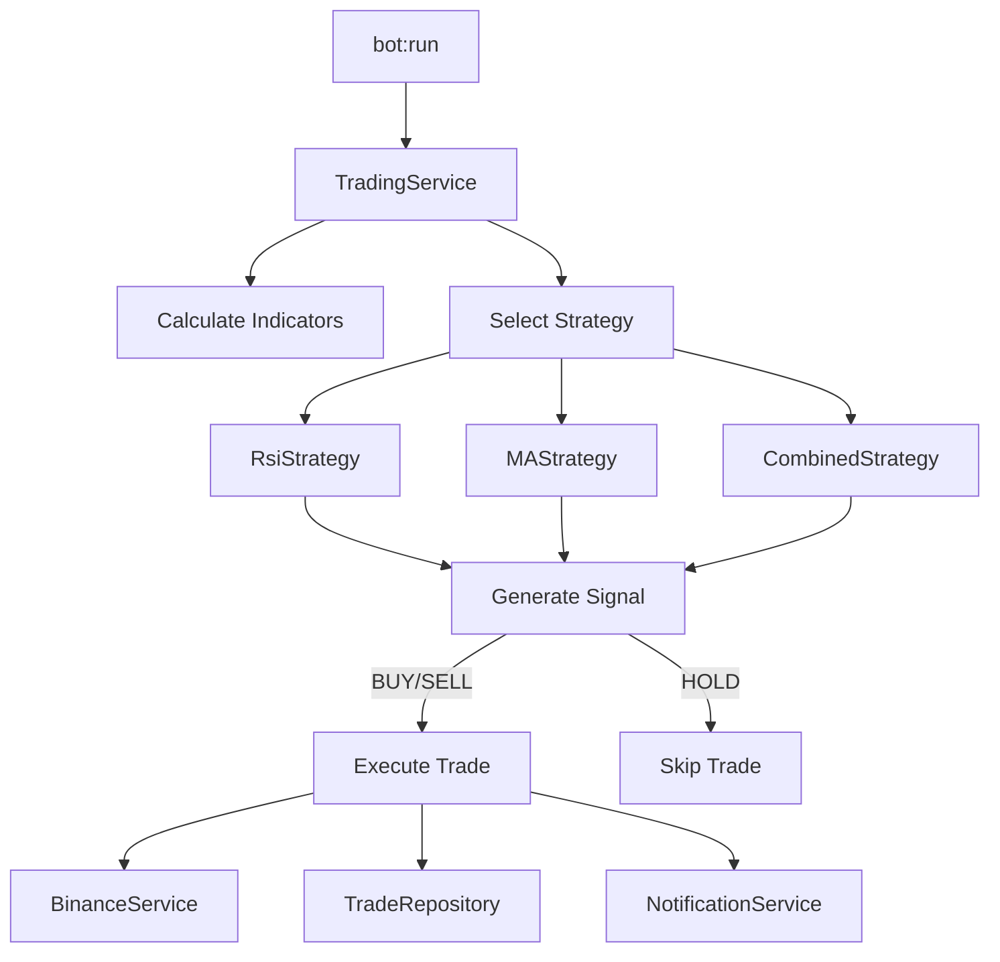

# Task 2.8 - TradingStrategy (analyse signaux, exécution trades)

## Objectif

Créer le service de stratégie de trading qui analyse les indicateurs, génère des signaux et exécute les trades.

## Fichiers à créer

| Fichier | Description |
|---------|-------------|
| `app/Contracts/TradingStrategyInterface.php` | Interface de la stratégie |
| `app/Services/Trading/Strategies/AbstractStrategy.php` | Classe abstraite commune |
| `app/Services/Trading/Strategies/RsiStrategy.php` | Stratégie RSI |
| `app/Services/Trading/Strategies/MovingAverageStrategy.php` | Stratégie MA |
| `app/Services/Trading/Strategies/CombinedStrategy.php` | Stratégie combinée |
| `app/Services/Trading/TradingService.php` | Service coordinateur |

## Architecture



## Implémentation

### 1. Interface TradingStrategyInterface

**Créer** : `app/Contracts/TradingStrategyInterface.php`

```php
<?php

declare(strict_types=1);

namespace App\Contracts;

use App\DTOs\IndicatorsDTO;
use App\Enums\Signal;
use App\Enums\Strategy;

interface TradingStrategyInterface
{
    /**
     * Analyse les indicateurs et génère un signal.
     */
    public function analyze(IndicatorsDTO $indicators): Signal;

    /**
     * Retourne le type de stratégie.
     */
    public function getType(): Strategy;

    /**
     * Retourne la raison du signal.
     */
    public function getSignalReason(): string;
}
```

### 2. AbstractStrategy

**Créer** : `app/Services/Trading/Strategies/AbstractStrategy.php`

```php
<?php

declare(strict_types=1);

namespace App\Services\Trading\Strategies;

use App\Contracts\TradingStrategyInterface;
use App\DTOs\IndicatorsDTO;
use App\Enums\Signal;

abstract class AbstractStrategy implements TradingStrategyInterface
{
    protected string $signalReason = '';

    public function getSignalReason(): string
    {
        return $this->signalReason;
    }

    protected function setSignalReason(string $reason): void
    {
        $this->signalReason = $reason;
    }

    /**
     * Vérifie que les indicateurs requis sont disponibles.
     */
    protected function validateIndicators(IndicatorsDTO $indicators, array $required): bool
    {
        foreach ($required as $indicator) {
            $value = match ($indicator) {
                'rsi' => $indicators->rsi,
                'ma50' => $indicators->ma50,
                'ma200' => $indicators->ma200,
                'currentPrice' => $indicators->currentPrice,
                default => null,
            };

            if ($value === null) {
                $this->setSignalReason("Missing indicator: {$indicator}");
                return false;
            }
        }

        return true;
    }
}
```

### 3. RsiStrategy

**Créer** : `app/Services/Trading/Strategies/RsiStrategy.php`

```php
<?php

declare(strict_types=1);

namespace App\Services\Trading\Strategies;

use App\DTOs\IndicatorsDTO;
use App\Enums\Signal;
use App\Enums\Strategy;

final class RsiStrategy extends AbstractStrategy
{
    private readonly float $oversoldThreshold;
    private readonly float $overboughtThreshold;

    public function __construct()
    {
        $this->oversoldThreshold = config('bot.strategy.rsi.oversold', 30.0);
        $this->overboughtThreshold = config('bot.strategy.rsi.overbought', 70.0);
    }

    public function analyze(IndicatorsDTO $indicators): Signal
    {
        if (!$this->validateIndicators($indicators, ['rsi'])) {
            return Signal::Hold;
        }

        $rsi = $indicators->rsi;

        // Signal d'achat : RSI en zone de survente
        if ($rsi < $this->oversoldThreshold) {
            $this->setSignalReason(
                "RSI ({$rsi}) below oversold threshold ({$this->oversoldThreshold})"
            );
            return Signal::Buy;
        }

        // Signal de vente : RSI en zone de surachat
        if ($rsi > $this->overboughtThreshold) {
            $this->setSignalReason(
                "RSI ({$rsi}) above overbought threshold ({$this->overboughtThreshold})"
            );
            return Signal::Sell;
        }

        // Pas de signal
        $this->setSignalReason(
            "RSI ({$rsi}) in neutral zone ({$this->oversoldThreshold}-{$this->overboughtThreshold})"
        );
        return Signal::Hold;
    }

    public function getType(): Strategy
    {
        return Strategy::Rsi;
    }
}
```

### 4. MovingAverageStrategy

**Créer** : `app/Services/Trading/Strategies/MovingAverageStrategy.php`

```php
<?php

declare(strict_types=1);

namespace App\Services\Trading\Strategies;

use App\DTOs\IndicatorsDTO;
use App\Enums\Signal;
use App\Enums\Strategy;

final class MovingAverageStrategy extends AbstractStrategy
{
    private ?bool $previousGoldenCross = null;

    public function analyze(IndicatorsDTO $indicators): Signal
    {
        if (!$this->validateIndicators($indicators, ['ma50', 'ma200'])) {
            return Signal::Hold;
        }

        $ma50 = $indicators->ma50;
        $ma200 = $indicators->ma200;
        $isGoldenCross = $ma50 > $ma200;

        // Détecter les croisements (pas juste l'état actuel)
        // En production, on stockerait l'état précédent en base

        // Golden Cross : MA50 passe au-dessus de MA200
        if ($isGoldenCross && $this->previousGoldenCross === false) {
            $this->setSignalReason(
                "Golden Cross detected: MA50 ({$ma50}) crossed above MA200 ({$ma200})"
            );
            $this->previousGoldenCross = true;
            return Signal::Buy;
        }

        // Death Cross : MA50 passe en-dessous de MA200
        if (!$isGoldenCross && $this->previousGoldenCross === true) {
            $this->setSignalReason(
                "Death Cross detected: MA50 ({$ma50}) crossed below MA200 ({$ma200})"
            );
            $this->previousGoldenCross = false;
            return Signal::Sell;
        }

        // Pas de croisement, mais on peut quand même signaler la tendance
        if ($isGoldenCross) {
            $this->setSignalReason(
                "Bullish trend: MA50 ({$ma50}) above MA200 ({$ma200}), waiting for entry signal"
            );
        } else {
            $this->setSignalReason(
                "Bearish trend: MA50 ({$ma50}) below MA200 ({$ma200}), waiting for entry signal"
            );
        }

        // Mémoriser l'état si c'est la première exécution
        $this->previousGoldenCross ??= $isGoldenCross;

        return Signal::Hold;
    }

    public function getType(): Strategy
    {
        return Strategy::MovingAverage;
    }

    /**
     * Permet de définir l'état précédent pour les tests ou la persistance.
     */
    public function setPreviousState(bool $wasGoldenCross): void
    {
        $this->previousGoldenCross = $wasGoldenCross;
    }
}
```

### 5. CombinedStrategy

**Créer** : `app/Services/Trading/Strategies/CombinedStrategy.php`

```php
<?php

declare(strict_types=1);

namespace App\Services\Trading\Strategies;

use App\DTOs\IndicatorsDTO;
use App\Enums\Signal;
use App\Enums\Strategy;

final class CombinedStrategy extends AbstractStrategy
{
    private readonly float $rsiOversold;
    private readonly float $rsiOverbought;

    public function __construct()
    {
        $this->rsiOversold = config('bot.strategy.rsi.oversold', 30.0);
        $this->rsiOverbought = config('bot.strategy.rsi.overbought', 70.0);
    }

    public function analyze(IndicatorsDTO $indicators): Signal
    {
        if (!$this->validateIndicators($indicators, ['rsi', 'ma50', 'ma200'])) {
            return Signal::Hold;
        }

        $rsi = $indicators->rsi;
        $isGoldenCross = $indicators->isGoldenCross();
        $isDeathCross = $indicators->isDeathCross();

        // Signal d'achat fort : RSI survente + tendance haussière (Golden Cross)
        if ($rsi < $this->rsiOversold && $isGoldenCross) {
            $this->setSignalReason(
                "Strong BUY: RSI oversold ({$rsi}) + Golden Cross (MA50 > MA200)"
            );
            return Signal::Buy;
        }

        // Signal de vente fort : RSI surachat + tendance baissière (Death Cross)
        if ($rsi > $this->rsiOverbought && $isDeathCross) {
            $this->setSignalReason(
                "Strong SELL: RSI overbought ({$rsi}) + Death Cross (MA50 < MA200)"
            );
            return Signal::Sell;
        }

        // Signal d'achat modéré : RSI survente uniquement
        if ($rsi < $this->rsiOversold) {
            $this->setSignalReason(
                "Moderate BUY: RSI oversold ({$rsi}), but MA trend not confirmed"
            );
            // On pourrait retourner Buy ici ou attendre la confirmation
            return Signal::Hold; // Conservative approach
        }

        // Signal de vente modéré : RSI surachat uniquement
        if ($rsi > $this->rsiOverbought) {
            $this->setSignalReason(
                "Moderate SELL: RSI overbought ({$rsi}), but MA trend not confirmed"
            );
            return Signal::Hold; // Conservative approach
        }

        // Pas de signal
        $trendDescription = $isGoldenCross ? 'bullish' : ($isDeathCross ? 'bearish' : 'neutral');
        $this->setSignalReason(
            "No signal: RSI neutral ({$rsi}), trend {$trendDescription}"
        );

        return Signal::Hold;
    }

    public function getType(): Strategy
    {
        return Strategy::Combined;
    }
}
```

### 6. TradingService

**Créer** : `app/Services/Trading/TradingService.php`

```php
<?php

declare(strict_types=1);

namespace App\Services\Trading;

use App\Contracts\BinanceServiceInterface;
use App\Contracts\BotConfigRepositoryInterface;
use App\Contracts\NotificationServiceInterface;
use App\Contracts\TradeRepositoryInterface;
use App\Contracts\TradingStrategyInterface;
use App\DTOs\IndicatorsDTO;
use App\DTOs\TradingResultDTO;
use App\Enums\KlineInterval;
use App\Enums\Signal;
use App\Enums\Strategy;
use App\Exceptions\InsufficientBalanceException;
use App\Services\Trading\Indicators\IndicatorService;
use App\Services\Trading\Strategies\CombinedStrategy;
use App\Services\Trading\Strategies\MovingAverageStrategy;
use App\Services\Trading\Strategies\RsiStrategy;
use Illuminate\Support\Facades\Log;

final class TradingService
{
    public function __construct(
        private readonly BinanceServiceInterface $binance,
        private readonly IndicatorService $indicatorService,
        private readonly TradeRepositoryInterface $tradeRepository,
        private readonly BotConfigRepositoryInterface $botConfigRepository,
        private readonly ?NotificationServiceInterface $notificationService = null,
    ) {}

    /**
     * Exécute la stratégie de trading.
     */
    public function execute(
        ?string $symbol = null,
        ?Strategy $strategy = null,
        bool $dryRun = false,
    ): TradingResultDTO {
        // Récupérer la configuration
        $symbol ??= $this->botConfigRepository->getSymbol();
        $strategy ??= $this->botConfigRepository->getStrategy();
        $amount = $this->botConfigRepository->getAmount();

        Log::info('Trading execution started', [
            'symbol' => $symbol,
            'strategy' => $strategy->value,
            'amount' => $amount,
            'dry_run' => $dryRun,
        ]);

        // Vérifier le cooldown
        if (!$this->checkCooldown()) {
            return TradingResultDTO::noTrade(
                symbol: $symbol,
                strategy: $strategy,
                signal: Signal::Hold,
                indicators: new IndicatorsDTO(),
                reason: 'Cooldown period active',
            );
        }

        // Vérifier le nombre de trades du jour
        if (!$this->checkDailyLimit()) {
            return TradingResultDTO::noTrade(
                symbol: $symbol,
                strategy: $strategy,
                signal: Signal::Hold,
                indicators: new IndicatorsDTO(),
                reason: 'Daily trade limit reached',
            );
        }

        // Calculer les indicateurs
        $indicators = $this->indicatorService->calculateForStrategy(
            symbol: $symbol,
            strategy: $strategy,
        );

        // Analyser avec la stratégie
        $strategyInstance = $this->createStrategy($strategy);
        $signal = $strategyInstance->analyze($indicators);
        $reason = $strategyInstance->getSignalReason();

        Log::info('Strategy analysis completed', [
            'signal' => $signal->value,
            'reason' => $reason,
            'indicators' => $indicators->toArray(),
        ]);

        // Mettre à jour le dernier signal
        $this->botConfigRepository->setLastSignal($signal->value);
        $this->botConfigRepository->setLastExecution(now());

        // Si pas de signal actionnable ou dry run
        if (!$signal->isActionable() || $dryRun) {
            return TradingResultDTO::noTrade(
                symbol: $symbol,
                strategy: $strategy,
                signal: $signal,
                indicators: $indicators,
                reason: $dryRun ? "Dry run: {$reason}" : $reason,
            );
        }

        // Exécuter le trade
        return $this->executeTrade(
            symbol: $symbol,
            strategy: $strategy,
            signal: $signal,
            indicators: $indicators,
            amount: $amount,
        );
    }

    /**
     * Exécute le trade.
     */
    private function executeTrade(
        string $symbol,
        Strategy $strategy,
        Signal $signal,
        IndicatorsDTO $indicators,
        float $amount,
    ): TradingResultDTO {
        try {
            $trade = match ($signal) {
                Signal::Buy => $this->binance->marketBuy($symbol, $amount),
                Signal::Sell => $this->executeSell($symbol),
                default => throw new \LogicException("Invalid signal: {$signal->value}"),
            };

            // Enregistrer le trade
            $tradeId = $this->tradeRepository->save(
                trade: $trade,
                strategy: $strategy->value,
                indicators: $indicators->toArray(),
            );

            Log::info('Trade executed successfully', [
                'trade_id' => $tradeId,
                'order_id' => $trade->orderId,
            ]);

            // Envoyer la notification
            $this->notificationService?->notifyTradeExecuted($trade);

            return TradingResultDTO::withTrade(
                symbol: $symbol,
                strategy: $strategy,
                signal: $signal,
                indicators: $indicators,
                trade: $trade,
            );

        } catch (InsufficientBalanceException $e) {
            Log::warning('Trade skipped: insufficient balance', [
                'asset' => $e->asset,
                'required' => $e->required,
                'available' => $e->available,
            ]);

            return TradingResultDTO::noTrade(
                symbol: $symbol,
                strategy: $strategy,
                signal: $signal,
                indicators: $indicators,
                reason: $e->getMessage(),
            );
        }
    }

    /**
     * Exécute une vente basée sur la position ouverte.
     */
    private function executeSell(string $symbol): \App\DTOs\TradeResultDTO
    {
        // Récupérer les positions ouvertes
        $openPositions = $this->tradeRepository->getOpenPositions($symbol);

        if ($openPositions->isEmpty()) {
            throw new InsufficientBalanceException(
                asset: $this->getBaseAsset($symbol),
                required: 0,
                available: 0,
            );
        }

        // Calculer la quantité totale à vendre
        $totalQuantity = $openPositions->sum('quantity');

        return $this->binance->marketSell($symbol, $totalQuantity);
    }

    /**
     * Crée l'instance de stratégie appropriée.
     */
    private function createStrategy(Strategy $strategy): TradingStrategyInterface
    {
        return match ($strategy) {
            Strategy::Rsi => new RsiStrategy(),
            Strategy::MovingAverage => new MovingAverageStrategy(),
            Strategy::Combined => new CombinedStrategy(),
        };
    }

    /**
     * Vérifie le cooldown entre les trades.
     */
    private function checkCooldown(): bool
    {
        $lastExecution = $this->botConfigRepository->getLastExecution();

        if ($lastExecution === null) {
            return true;
        }

        $cooldownMinutes = config('bot.trading.cooldown_minutes', 5);
        $nextAllowed = $lastExecution->addMinutes($cooldownMinutes);

        return now()->gte($nextAllowed);
    }

    /**
     * Vérifie la limite quotidienne de trades.
     */
    private function checkDailyLimit(): bool
    {
        $maxTrades = config('bot.trading.max_trades_per_day', 50);
        $todayTrades = $this->tradeRepository->countByDate(now());

        return $todayTrades < $maxTrades;
    }

    /**
     * Extrait l'actif de base d'un symbole.
     */
    private function getBaseAsset(string $symbol): string
    {
        $info = $this->binance->getSymbolInfo($symbol);
        return $info['baseAsset'] ?? substr($symbol, 0, -4); // Fallback
    }
}
```

## Tests

**Créer** : `tests/Unit/Services/Trading/Strategies/RsiStrategyTest.php`

```php
<?php

declare(strict_types=1);

namespace Tests\Unit\Services\Trading\Strategies;

use App\DTOs\IndicatorsDTO;
use App\Enums\Signal;
use App\Enums\Strategy;
use App\Services\Trading\Strategies\RsiStrategy;
use Tests\TestCase;

final class RsiStrategyTest extends TestCase
{
    private RsiStrategy $strategy;

    protected function setUp(): void
    {
        parent::setUp();
        $this->strategy = new RsiStrategy();
    }

    public function test_buy_signal_when_rsi_oversold(): void
    {
        $indicators = new IndicatorsDTO(rsi: 25.0);

        $signal = $this->strategy->analyze($indicators);

        $this->assertEquals(Signal::Buy, $signal);
        $this->assertStringContainsString('oversold', $this->strategy->getSignalReason());
    }

    public function test_sell_signal_when_rsi_overbought(): void
    {
        $indicators = new IndicatorsDTO(rsi: 75.0);

        $signal = $this->strategy->analyze($indicators);

        $this->assertEquals(Signal::Sell, $signal);
        $this->assertStringContainsString('overbought', $this->strategy->getSignalReason());
    }

    public function test_hold_signal_when_rsi_neutral(): void
    {
        $indicators = new IndicatorsDTO(rsi: 50.0);

        $signal = $this->strategy->analyze($indicators);

        $this->assertEquals(Signal::Hold, $signal);
        $this->assertStringContainsString('neutral', $this->strategy->getSignalReason());
    }

    public function test_hold_when_rsi_missing(): void
    {
        $indicators = new IndicatorsDTO();

        $signal = $this->strategy->analyze($indicators);

        $this->assertEquals(Signal::Hold, $signal);
        $this->assertStringContainsString('Missing', $this->strategy->getSignalReason());
    }

    public function test_strategy_type(): void
    {
        $this->assertEquals(Strategy::Rsi, $this->strategy->getType());
    }
}
```

**Créer** : `tests/Unit/Services/Trading/Strategies/CombinedStrategyTest.php`

```php
<?php

declare(strict_types=1);

namespace Tests\Unit\Services\Trading\Strategies;

use App\DTOs\IndicatorsDTO;
use App\Enums\Signal;
use App\Services\Trading\Strategies\CombinedStrategy;
use Tests\TestCase;

final class CombinedStrategyTest extends TestCase
{
    private CombinedStrategy $strategy;

    protected function setUp(): void
    {
        parent::setUp();
        $this->strategy = new CombinedStrategy();
    }

    public function test_strong_buy_signal(): void
    {
        // RSI oversold + Golden Cross
        $indicators = new IndicatorsDTO(
            rsi: 25.0,
            ma50: 42000.0,
            ma200: 41000.0, // MA50 > MA200 = Golden Cross
        );

        $signal = $this->strategy->analyze($indicators);

        $this->assertEquals(Signal::Buy, $signal);
        $this->assertStringContainsString('Strong BUY', $this->strategy->getSignalReason());
    }

    public function test_strong_sell_signal(): void
    {
        // RSI overbought + Death Cross
        $indicators = new IndicatorsDTO(
            rsi: 75.0,
            ma50: 41000.0,
            ma200: 42000.0, // MA50 < MA200 = Death Cross
        );

        $signal = $this->strategy->analyze($indicators);

        $this->assertEquals(Signal::Sell, $signal);
        $this->assertStringContainsString('Strong SELL', $this->strategy->getSignalReason());
    }

    public function test_hold_when_only_rsi_oversold(): void
    {
        // RSI oversold mais Death Cross (conservative)
        $indicators = new IndicatorsDTO(
            rsi: 25.0,
            ma50: 41000.0,
            ma200: 42000.0, // MA50 < MA200 = Death Cross
        );

        $signal = $this->strategy->analyze($indicators);

        $this->assertEquals(Signal::Hold, $signal);
        $this->assertStringContainsString('Moderate BUY', $this->strategy->getSignalReason());
    }

    public function test_hold_when_neutral(): void
    {
        $indicators = new IndicatorsDTO(
            rsi: 50.0,
            ma50: 42000.0,
            ma200: 41000.0,
        );

        $signal = $this->strategy->analyze($indicators);

        $this->assertEquals(Signal::Hold, $signal);
    }
}
```

## Dépendances

- **Prérequis** : Tâches 2.3-2.7 (Enums, DTOs, Repositories, BinanceService, Indicators)
- **Utilisé par** : Tâche 2.12 (Commande bot:run)

## Checklist

- [ ] Créer `app/Contracts/TradingStrategyInterface.php`
- [ ] Créer `app/Services/Trading/Strategies/AbstractStrategy.php`
- [ ] Créer `app/Services/Trading/Strategies/RsiStrategy.php`
- [ ] Créer `app/Services/Trading/Strategies/MovingAverageStrategy.php`
- [ ] Créer `app/Services/Trading/Strategies/CombinedStrategy.php`
- [ ] Créer `app/Services/Trading/TradingService.php`
- [ ] Créer les tests unitaires pour chaque stratégie
- [ ] Tester l'intégration avec le BinanceService (mock)
- [ ] Vérifier avec `php artisan test --filter=Trading`
- [ ] Vérifier avec `vendor/bin/pint`
