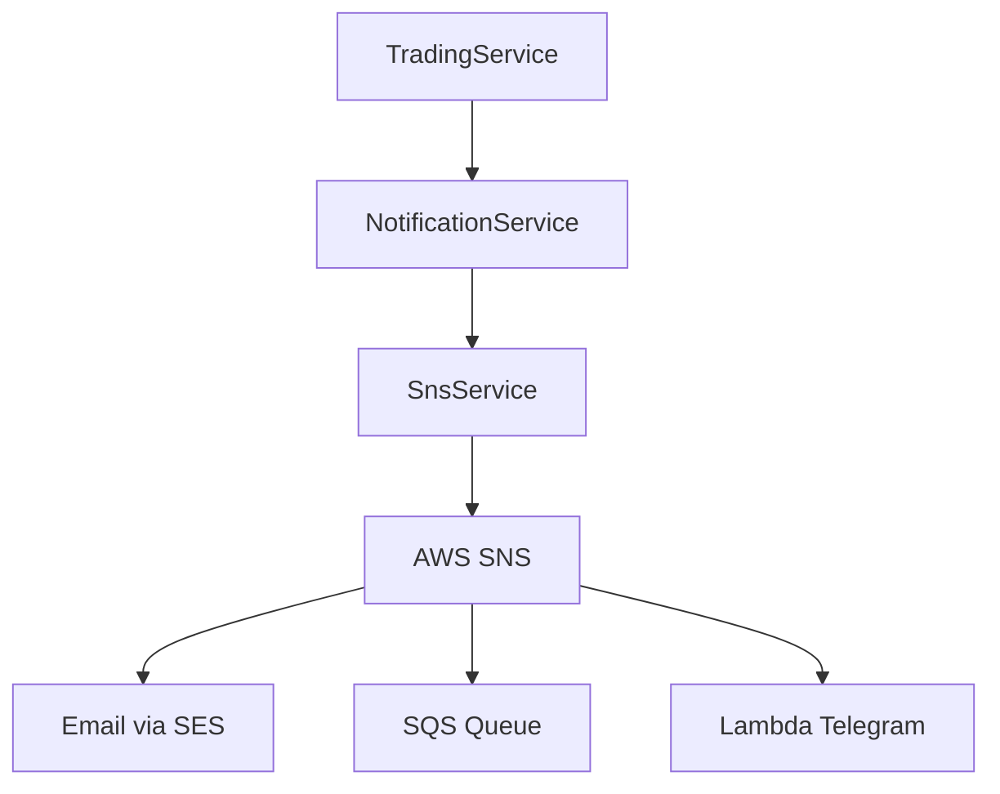

# Task 2.9 - NotificationService (SNS publish, alertes)

## Objectif

Créer le service de notifications pour publier des alertes via AWS SNS (trades exécutés, erreurs critiques).

## Fichiers à créer

| Fichier | Description |
|---------|-------------|
| `app/Contracts/NotificationServiceInterface.php` | Interface du service |
| `app/Services/Notification/SnsService.php` | Service SNS |
| `app/Services/Notification/NotificationService.php` | Service coordinateur |
| `app/Exceptions/NotificationException.php` | Exception notifications |

## Architecture



## Topics SNS

| Topic | Usage | ARN Environment Variable |
|-------|-------|--------------------------|
| trade-alerts | Notifications de trades | `SNS_TOPIC_TRADE_ALERTS` |
| error-alerts | Alertes d'erreurs | `SNS_TOPIC_ERROR_ALERTS` |

## Implémentation

### 1. Interface NotificationServiceInterface

**Créer** : `app/Contracts/NotificationServiceInterface.php`

```php
<?php

declare(strict_types=1);

namespace App\Contracts;

use App\DTOs\TradeResultDTO;
use Throwable;

interface NotificationServiceInterface
{
    /**
     * Notifie qu'un trade a été exécuté.
     */
    public function notifyTradeExecuted(TradeResultDTO $trade): void;

    /**
     * Notifie une erreur critique.
     */
    public function notifyError(string $type, string $message, array $context = []): void;

    /**
     * Notifie une exception critique.
     */
    public function notifyCriticalError(Throwable $exception): void;

    /**
     * Notifie un solde bas.
     */
    public function notifyLowBalance(string $asset, float $balance, float $threshold): void;

    /**
     * Vérifie si les notifications sont activées.
     */
    public function isEnabled(): bool;
}
```

### 2. NotificationException

**Créer** : `app/Exceptions/NotificationException.php`

```php
<?php

declare(strict_types=1);

namespace App\Exceptions;

use Exception;
use Throwable;

class NotificationException extends Exception
{
    public function __construct(
        string $message,
        public readonly ?string $channel = null,
        public readonly ?array $context = null,
        int $code = 0,
        ?Throwable $previous = null,
    ) {
        parent::__construct($message, $code, $previous);
    }

    public function context(): array
    {
        return array_filter([
            'channel' => $this->channel,
            'context' => $this->context,
        ]);
    }
}
```

### 3. SnsService

**Créer** : `app/Services/Notification/SnsService.php`

```php
<?php

declare(strict_types=1);

namespace App\Services\Notification;

use App\Exceptions\NotificationException;
use Aws\Sns\SnsClient;
use Illuminate\Support\Facades\Log;

final class SnsService
{
    private readonly SnsClient $client;

    public function __construct()
    {
        $config = [
            'region' => config('services.aws.region', 'eu-west-3'),
            'version' => 'latest',
        ];

        // Credentials uniquement en local
        if (config('services.aws.credentials.key')) {
            $config['credentials'] = [
                'key' => config('services.aws.credentials.key'),
                'secret' => config('services.aws.credentials.secret'),
            ];
        }

        $this->client = new SnsClient($config);
    }

    /**
     * Publie un message sur un topic SNS.
     */
    public function publish(
        string $topicArn,
        array $message,
        ?string $subject = null,
        array $attributes = [],
    ): string {
        if (empty($topicArn)) {
            throw new NotificationException(
                message: 'SNS topic ARN is not configured',
                channel: 'sns',
            );
        }

        try {
            $params = [
                'TopicArn' => $topicArn,
                'Message' => json_encode($message, JSON_THROW_ON_ERROR),
            ];

            if ($subject !== null) {
                $params['Subject'] = substr($subject, 0, 100); // Max 100 chars
            }

            if (!empty($attributes)) {
                $params['MessageAttributes'] = $this->formatAttributes($attributes);
            }

            $result = $this->client->publish($params);
            $messageId = $result->get('MessageId');

            Log::info('SNS message published', [
                'topic_arn' => $topicArn,
                'message_id' => $messageId,
                'subject' => $subject,
            ]);

            return $messageId;

        } catch (\Aws\Exception\AwsException $e) {
            Log::error('SNS publish failed', [
                'topic_arn' => $topicArn,
                'error' => $e->getMessage(),
                'aws_code' => $e->getAwsErrorCode(),
            ]);

            throw new NotificationException(
                message: "Failed to publish SNS message: {$e->getMessage()}",
                channel: 'sns',
                context: ['topic_arn' => $topicArn],
                previous: $e,
            );
        }
    }

    /**
     * Publie sur le topic des alertes de trade.
     */
    public function publishTradeAlert(array $message, ?string $subject = null): string
    {
        $topicArn = config('services.sns.topics.trade_alerts');

        return $this->publish(
            topicArn: $topicArn,
            message: $message,
            subject: $subject,
            attributes: [
                'event_type' => ['DataType' => 'String', 'StringValue' => 'TRADE_EXECUTED'],
            ],
        );
    }

    /**
     * Publie sur le topic des alertes d'erreur.
     */
    public function publishErrorAlert(array $message, ?string $subject = null): string
    {
        $topicArn = config('services.sns.topics.error_alerts');

        return $this->publish(
            topicArn: $topicArn,
            message: $message,
            subject: $subject,
            attributes: [
                'event_type' => ['DataType' => 'String', 'StringValue' => 'ERROR_ALERT'],
                'priority' => ['DataType' => 'String', 'StringValue' => 'high'],
            ],
        );
    }

    /**
     * Formate les attributs du message.
     */
    private function formatAttributes(array $attributes): array
    {
        $formatted = [];

        foreach ($attributes as $key => $value) {
            if (is_array($value)) {
                $formatted[$key] = $value;
            } else {
                $formatted[$key] = [
                    'DataType' => 'String',
                    'StringValue' => (string) $value,
                ];
            }
        }

        return $formatted;
    }
}
```

### 4. NotificationService

**Créer** : `app/Services/Notification/NotificationService.php`

```php
<?php

declare(strict_types=1);

namespace App\Services\Notification;

use App\Contracts\NotificationServiceInterface;
use App\DTOs\TradeResultDTO;
use App\Exceptions\NotificationException;
use Illuminate\Support\Facades\Log;
use Throwable;

final class NotificationService implements NotificationServiceInterface
{
    public function __construct(
        private readonly SnsService $snsService,
    ) {}

    public function notifyTradeExecuted(TradeResultDTO $trade): void
    {
        if (!$this->isEnabled() || !config('bot.notifications.trade_executed', true)) {
            return;
        }

        try {
            $this->snsService->publishTradeAlert(
                message: [
                    'type' => 'TRADE_EXECUTED',
                    'timestamp' => now()->toIso8601String(),
                    'data' => [
                        'order_id' => $trade->orderId,
                        'symbol' => $trade->symbol,
                        'side' => $trade->side->value,
                        'type' => $trade->type->value,
                        'status' => $trade->status->value,
                        'quantity' => $trade->quantity,
                        'price' => $trade->price,
                        'quote_quantity' => $trade->quoteQuantity,
                        'commission' => $trade->commission,
                    ],
                ],
                subject: "Trade Executed: {$trade->side->value} {$trade->symbol}",
            );

            Log::info('Trade notification sent', [
                'order_id' => $trade->orderId,
            ]);

        } catch (NotificationException $e) {
            // Log mais ne pas propager l'erreur
            Log::warning('Failed to send trade notification', [
                'order_id' => $trade->orderId,
                'error' => $e->getMessage(),
            ]);
        }
    }

    public function notifyError(string $type, string $message, array $context = []): void
    {
        if (!$this->isEnabled() || !config('bot.notifications.errors', true)) {
            return;
        }

        try {
            $this->snsService->publishErrorAlert(
                message: [
                    'type' => 'ERROR_ALERT',
                    'error_type' => $type,
                    'message' => $message,
                    'context' => $context,
                    'timestamp' => now()->toIso8601String(),
                    'environment' => config('app.env'),
                ],
                subject: "Error Alert: {$type}",
            );

            Log::info('Error notification sent', [
                'type' => $type,
            ]);

        } catch (NotificationException $e) {
            Log::warning('Failed to send error notification', [
                'type' => $type,
                'error' => $e->getMessage(),
            ]);
        }
    }

    public function notifyCriticalError(Throwable $exception): void
    {
        $this->notifyError(
            type: get_class($exception),
            message: $exception->getMessage(),
            context: [
                'file' => $exception->getFile(),
                'line' => $exception->getLine(),
                'trace' => $this->formatTrace($exception),
            ],
        );
    }

    public function notifyLowBalance(string $asset, float $balance, float $threshold): void
    {
        if (!$this->isEnabled()) {
            return;
        }

        try {
            $this->snsService->publishErrorAlert(
                message: [
                    'type' => 'LOW_BALANCE_ALERT',
                    'asset' => $asset,
                    'balance' => $balance,
                    'threshold' => $threshold,
                    'timestamp' => now()->toIso8601String(),
                ],
                subject: "Low Balance Alert: {$asset}",
            );

            Log::info('Low balance notification sent', [
                'asset' => $asset,
                'balance' => $balance,
            ]);

        } catch (NotificationException $e) {
            Log::warning('Failed to send low balance notification', [
                'asset' => $asset,
                'error' => $e->getMessage(),
            ]);
        }
    }

    public function isEnabled(): bool
    {
        // Vérifie que les topics SNS sont configurés
        return !empty(config('services.sns.topics.trade_alerts'))
            || !empty(config('services.sns.topics.error_alerts'));
    }

    /**
     * Formate la stack trace pour la notification.
     */
    private function formatTrace(Throwable $exception, int $limit = 5): array
    {
        $trace = [];
        $frames = array_slice($exception->getTrace(), 0, $limit);

        foreach ($frames as $frame) {
            $trace[] = sprintf(
                '%s:%s %s%s%s()',
                $frame['file'] ?? 'unknown',
                $frame['line'] ?? 0,
                $frame['class'] ?? '',
                $frame['type'] ?? '',
                $frame['function'] ?? 'unknown',
            );
        }

        return $trace;
    }
}
```

### 5. Enregistrement dans le Service Provider

**Modifier** : `app/Providers/AppServiceProvider.php`

```php
// Ajouter dans les bindings
public array $bindings = [
    // ... autres bindings
    NotificationServiceInterface::class => NotificationService::class,
];

// Ajouter dans register()
public function register(): void
{
    // ... code existant

    $this->app->singleton(SnsService::class);
}
```

## Structure des Messages SNS

### Message Trade Executed

```json
{
  "type": "TRADE_EXECUTED",
  "timestamp": "2024-12-06T10:30:15+00:00",
  "data": {
    "order_id": "123456789",
    "symbol": "BTCUSDT",
    "side": "BUY",
    "type": "MARKET",
    "status": "FILLED",
    "quantity": 0.001,
    "price": 42500.0,
    "quote_quantity": 42.5,
    "commission": 0.0425
  }
}
```

### Message Error Alert

```json
{
  "type": "ERROR_ALERT",
  "error_type": "App\\Exceptions\\BinanceApiException",
  "message": "Rate limit exceeded",
  "context": {
    "file": "/app/Services/Binance/BinanceClient.php",
    "line": 123,
    "trace": ["..."]
  },
  "timestamp": "2024-12-06T10:30:15+00:00",
  "environment": "production"
}
```

### Message Low Balance

```json
{
  "type": "LOW_BALANCE_ALERT",
  "asset": "USDT",
  "balance": 50.0,
  "threshold": 100.0,
  "timestamp": "2024-12-06T10:30:15+00:00"
}
```

## Tests

**Créer** : `tests/Unit/Services/Notification/NotificationServiceTest.php`

```php
<?php

declare(strict_types=1);

namespace Tests\Unit\Services\Notification;

use App\Contracts\NotificationServiceInterface;
use App\DTOs\TradeResultDTO;
use App\Enums\OrderSide;
use App\Enums\OrderStatus;
use App\Enums\OrderType;
use App\Services\Notification\NotificationService;
use App\Services\Notification\SnsService;
use DateTimeImmutable;
use Mockery;
use Mockery\MockInterface;
use Tests\TestCase;

final class NotificationServiceTest extends TestCase
{
    private NotificationService $service;
    private MockInterface $snsMock;

    protected function setUp(): void
    {
        parent::setUp();

        $this->snsMock = Mockery::mock(SnsService::class);
        $this->service = new NotificationService($this->snsMock);

        // Configure SNS topics
        config(['services.sns.topics.trade_alerts' => 'arn:aws:sns:eu-west-3:123:trade-alerts']);
        config(['services.sns.topics.error_alerts' => 'arn:aws:sns:eu-west-3:123:error-alerts']);
        config(['bot.notifications.trade_executed' => true]);
        config(['bot.notifications.errors' => true]);
    }

    public function test_notify_trade_executed(): void
    {
        $trade = new TradeResultDTO(
            orderId: '12345',
            clientOrderId: 'test',
            symbol: 'BTCUSDT',
            side: OrderSide::Buy,
            type: OrderType::Market,
            status: OrderStatus::Filled,
            quantity: 0.001,
            price: 42500.0,
            quoteQuantity: 42.50,
            commission: 0.04,
            commissionAsset: 'USDT',
            executedAt: new DateTimeImmutable(),
        );

        $this->snsMock
            ->shouldReceive('publishTradeAlert')
            ->once()
            ->withArgs(function ($message, $subject) {
                return $message['type'] === 'TRADE_EXECUTED'
                    && str_contains($subject, 'BUY');
            })
            ->andReturn('msg-id-123');

        $this->service->notifyTradeExecuted($trade);
    }

    public function test_notify_error(): void
    {
        $this->snsMock
            ->shouldReceive('publishErrorAlert')
            ->once()
            ->withArgs(function ($message, $subject) {
                return $message['error_type'] === 'API_ERROR'
                    && $message['message'] === 'Connection failed';
            })
            ->andReturn('msg-id-456');

        $this->service->notifyError('API_ERROR', 'Connection failed', ['endpoint' => '/api/v3/order']);
    }

    public function test_notify_low_balance(): void
    {
        $this->snsMock
            ->shouldReceive('publishErrorAlert')
            ->once()
            ->withArgs(function ($message, $subject) {
                return $message['type'] === 'LOW_BALANCE_ALERT'
                    && $message['asset'] === 'USDT';
            })
            ->andReturn('msg-id-789');

        $this->service->notifyLowBalance('USDT', 50.0, 100.0);
    }

    public function test_is_enabled_returns_true_when_configured(): void
    {
        $this->assertTrue($this->service->isEnabled());
    }

    public function test_is_enabled_returns_false_when_not_configured(): void
    {
        config(['services.sns.topics.trade_alerts' => null]);
        config(['services.sns.topics.error_alerts' => null]);

        $this->assertFalse($this->service->isEnabled());
    }

    protected function tearDown(): void
    {
        Mockery::close();
        parent::tearDown();
    }
}
```

## Utilisation

```php
use App\Contracts\NotificationServiceInterface;

class TradingService
{
    public function __construct(
        private readonly NotificationServiceInterface $notifications,
    ) {}

    public function executeTrade(): void
    {
        try {
            $trade = $this->binance->marketBuy('BTCUSDT', 100);

            // Notifier le succès
            $this->notifications->notifyTradeExecuted($trade);

        } catch (BinanceApiException $e) {
            // Notifier l'erreur
            $this->notifications->notifyCriticalError($e);
        }
    }
}
```

## Dépendances

- **Prérequis** : Tâches 2.4 (DTOs)
- **Infrastructure** : Topics SNS créés (Phase 1, Task 1.4)
- **Utilisé par** : Tâches 2.8 (TradingService), 2.11 (ReportService)

## Checklist

- [ ] Créer `app/Contracts/NotificationServiceInterface.php`
- [ ] Créer `app/Exceptions/NotificationException.php`
- [ ] Créer `app/Services/Notification/SnsService.php`
- [ ] Créer `app/Services/Notification/NotificationService.php`
- [ ] Enregistrer dans `AppServiceProvider`
- [ ] Créer les tests unitaires
- [ ] Tester avec SNS réel (ou LocalStack)
- [ ] Vérifier avec `vendor/bin/pint`
